# Catalog Backend: сводка работы с начала проекта

> [!summary]
> Эта заметка - подробная карта проделанной работы по backend-части проекта `catalog`. Она собрана по текущему состоянию репозитория: истории коммитов, модулям NestJS, Prisma-схемам, миграционным скриптам, документации деплоя и observability.

Связанные узлы для Obsidian:

- [[Catalog Backend]]
- [[NestJS]]
- [[Prisma]]
- [[PostgreSQL]]
- [[Redis]]
- [[S3]]
- [[MoySklad]]
- [[Observability]]
- [[Caddy]]
- [[Custom Domains]]
- [[Legacy Migration]]
- [[Product Catalog]]

## Оглавление

- [[#1. Главная идея проекта]]
- [[#2. Хронология работы]]
- [[#3. Карта архитектуры]]
- [[#4. Доменная модель]]
- [[#5. Мультикаталожность и tenant context]]
- [[#6. Каталоги, типы и атрибуты]]
- [[#7. Товары, варианты, категории и бренды]]
- [[#8. Медиа, S3 и очередь обработки изображений]]
- [[#9. SEO]]
- [[#10. Корзина и публичный сценарий менеджера]]
- [[#11. Авторизация, сессии и защита]]
- [[#12. Интеграция МойСклад]]
- [[#13. Админка, платежи, промокоды и управление каталогами]]
- [[#14. Кастомные домены, Caddy и TLS]]
- [[#15. Observability]]
- [[#16. Legacy migration и backfill]]
- [[#17. Тесты и качество]]
- [[#18. Команды запуска]]
- [[#19. Что важно помнить дальше]]
- [[#20. Obsidian graph]]

## 1. Главная идея проекта

`backend` - это NestJS API для мультикаталожной платформы. Один backend обслуживает много каталогов, где каждый каталог может быть магазином, рестораном, брендом или другим типом витрины. Каталог определяется по домену или поддомену, получает собственный контекст, а дальше все запросы к товарам, категориям, корзине, SEO, интеграциям и медиа работают уже внутри этого контекста.

Ключевые принципы, которые сформировались в проекте:

- один backend обслуживает много каталогов;
- каждый каталог связан с типом, а тип задает схему атрибутов;
- товары имеют базовые поля, кастомные атрибуты, варианты, категории, бренд, медиа и SEO;
- загрузка изображений вынесена в S3-слой с генерацией вариантов;
- корзина живет по токену/cookie и может переходить в публичный сценарий менеджера;
- интеграция с МойСклад синхронизирует товары, категории, остатки, цены и изображения;
- observability сделана как отдельный слой: метрики, логи, трейсы, dashboards;
- миграция со старой базы оформлена как фазовый pipeline с dry-run/apply режимами.

```mermaid
flowchart TD
    User[Пользователь или админ] --> Edge[Caddy / Nginx / HTTPS]
    Edge --> API[NestJS backend]
    API --> Tenant[CatalogContextMiddleware]
    Tenant --> Guard[CatalogGuard]
    Guard --> Controllers[Controllers]
    Controllers --> Services[Services]
    Services --> Prisma[PrismaService]
    Prisma --> DB[(PostgreSQL)]
    Services --> Redis[(Redis)]
    Services --> S3[(S3 / object storage)]
    Services --> Queue[BullMQ queues]
    API --> Metrics[/metrics]
    API --> Logs[JSON logs]
    API --> Traces[OpenTelemetry traces]
    Metrics --> Alloy[Grafana Alloy]
    Logs --> Alloy
    Traces --> Alloy
    Alloy --> Grafana[Grafana stack]
```

## 2. Хронология работы

> [!info]
> Хронология ниже собрана по `git log --reverse`. Там есть коммиты с краткими сообщениями `fix`, `f`, `feat`, поэтому часть деталей восстановлена по текущей структуре кода.

### Декабрь 2025: стартовая база

11 декабря 2025 появился первый коммит `init`. Проект стартовал как NestJS backend с TypeScript, стандартной структурой `src`, `test`, `package.json`, `tsconfig`, `nest-cli.json`.

На этом этапе фундамент был такой:

- NestJS как основной backend framework;
- TypeScript как язык проекта;
- Prisma как ORM-слой;
- PostgreSQL как целевая база;
- подготовка к модульной архитектуре.

### Январь 2026: первые доменные модули

14 января 2026 коммит `feat: init modules` обозначил переход от starter-проекта к реальной доменной структуре.

19 января 2026 коммит `feat: add crud catalog` добавил основу управления каталогами. Именно отсюда начала собираться главная идея проекта: `Catalog` как центральная сущность платформы.

В январе сформировались первые узлы:

- [[Catalog]];
- [[Type]];
- [[User]];
- базовые CRUD-паттерны через controller/service/repository;
- будущая мультикаталожность.

### Февраль 2026: медиа, атрибуты, адаптация модели

5 февраля 2026 коммит `init: 50%` показывает, что к этому моменту проект уже был наполовину собран как рабочий backend.

10 февраля 2026 коммит `feat: add s3 module` добавил отдельный модуль загрузки и хранения файлов.

16 февраля 2026 коммит `feat: normalize attribute` заложил важную часть доменной модели: товары не должны быть жестко привязаны к одному набору полей. Тип каталога определяет схему атрибутов, а конкретные товары получают значения этих атрибутов.

19 февраля 2026 были правки ESLint и адаптивности кода.

25 февраля 2026 коммит `feat: add brand module` добавил бренды как отдельную доменную сущность.

Итог февраля:

- появился [[S3 Module]];
- появилась нормализованная модель [[Attribute]];
- появился [[Brand Module]];
- продуктовая модель стала гибче;
- код начали подчищать под ESLint и единый стиль.

### Март 2026: продукты, ошибки, рефакторинг, МойСклад, prerelease

4 марта 2026 коммит `fix: create product` указывает на активную стабилизацию создания товаров.

10 марта 2026 началась работа над ошибками и TypeScript/ESLint проблемами.

12 марта 2026 коммит `feat: refactor code` говорит о крупной чистке структуры.

23 марта 2026 коммит `feat: add toogle popular mode by Product module` добавил переключение популярности товара.

24 марта 2026 коммит `feat: add integration moysklad` ввел интеграцию с МойСклад.

30 марта 2026 коммит `feat: pre release 0.9.0` зафиксировал первую предрелизную сборку.

Итог марта:

- продукты стали полноценным центром витрины;
- появились рекомендации, популярные товары, статусы, дублирование;
- началась интеграция с внешней товароучетной системой;
- проект приблизился к состоянию публичного prerelease.

### Апрель 2026: observability, throttling, деплой, домены, графы

1-2 апреля 2026 добавлялись логи и observability. В проекте появился слой Grafana + Loki + Tempo + Mimir + Alloy, JSON-логи, `/metrics`, `/observability/health`, OpenTelemetry.

10 апреля 2026 была исправлена проблема throttling для auth-пользователей. Сейчас throttling работает через Redis и умеет отдельно ограничивать auth-flow.

17 апреля 2026 были prerelease и исправления миграции.

20 апреля 2026 серия коммитов `fix graph` указывает на работу над графами/связями/визуализацией или структурными зависимостями. По текущему коду это хорошо ложится на усиление доменных связей: catalog, domain, media, metrics, migration, observability.

22-23 апреля 2026 продолжалась стабилизация.

28 апреля 2026 коммит `feat: add module admin` добавил админский слой управления каталогами.

29-30 апреля 2026 исправлялись cookies, localhost-сценарии и финальная стабильность.

Итог апреля:

- observability перестал быть идеей и стал частью приложения;
- auth получил Redis lockout и session-flow;
- появилась админка;
- деплой и custom domains были оформлены в runbook;
- проект стал ближе к production-режиму.

### Май 2026: стабилизация, миграции, backfill

1-6 мая 2026 шла серия исправлений.

4 мая 2026 в репозитории уже есть `migration`-слой, `deploy`-документация и production runbook.

5 мая 2026 появились новые feature/fix-коммиты.

6 мая 2026 проект находится в состоянии активной стабилизации перед дальнейшим разворачиванием.

7 мая 2026 добавлена эта Obsidian-сводка.

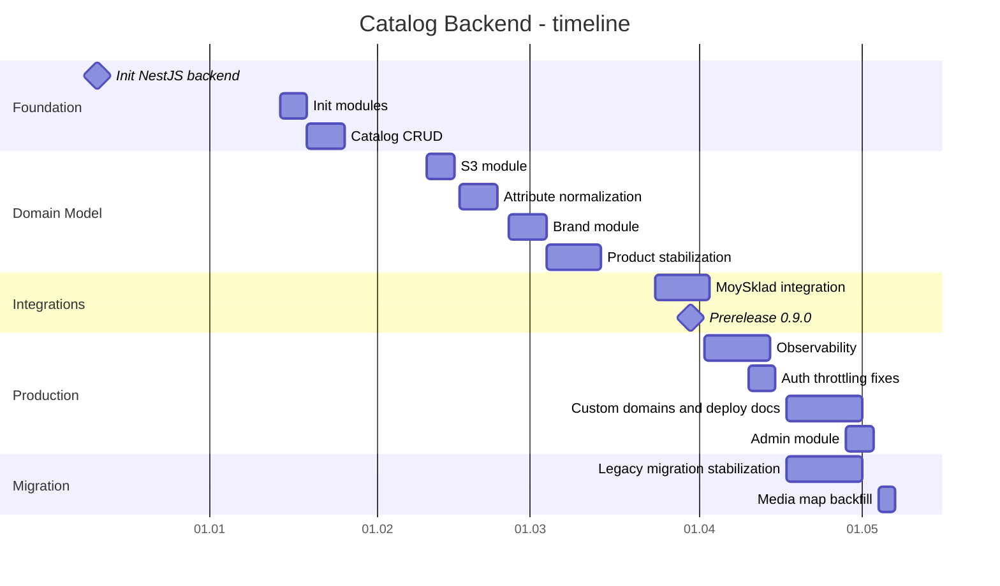

## 3. Карта архитектуры

Главная точка сборки приложения - `src/core/app.module.ts`.

Он подключает:

- `ConfigModule` с env-конфигами базы, Redis, HTTP, S3 и integration crypto;
- `ThrottlerModule` с Redis-хранилищем;
- `ObservabilityModule`;
- `CacheModule`;
- `PrismaModule`;
- доменные модули: `Type`, `Auth`, `Admin`, `Attribute`, `Brand`, `User`, `Catalog`, `Category`, `Cron`, `Integration`, `Cart`, `Product`, `S3`, `Seo`;
- глобальный `GlobalExceptionFilter`;
- глобальные guards: `CustomThrottlerGuard`, `CatalogGuard`;
- `CatalogContextMiddleware` для каждого route.

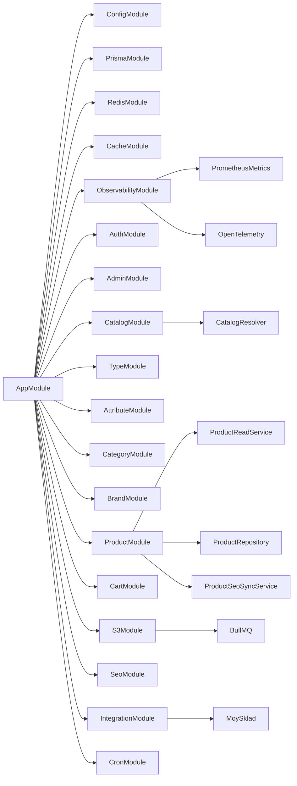

Архитектура держится на привычном NestJS-разделении:

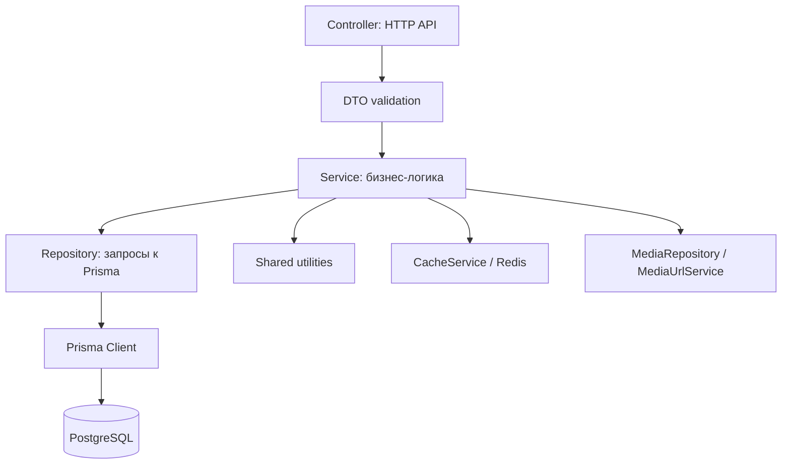

## 4. Доменная модель

В Prisma-схемах проект разбит по файлам:

- `catalog.prisma` - каталоги, настройки, контакты, домены;
- `type.prisma` - типы каталогов;
- `attribute.prisma` - определения атрибутов, enum-значения, variant-атрибуты;
- `product.prisma` - товары, значения атрибутов, варианты, product-media;
- `category.prisma` - категории и позиции товаров в категориях;
- `brand.prisma` - бренды;
- `media.prisma` - медиа и варианты изображений;
- `cart.prisma` - корзина и позиции корзины;
- `order.prisma` - заказы;
- `payment.prisma` и `promo-code.prisma` - оплаты, подписки и промокоды;
- `integration.prisma` - интеграции и external links;
- `migration.prisma` - запуск миграций, entity map, issues;
- `analytics.prisma`, `metric.prisma`, `seo.prisma`, `audit.prisma` - аналитика, метрики, SEO, аудит.

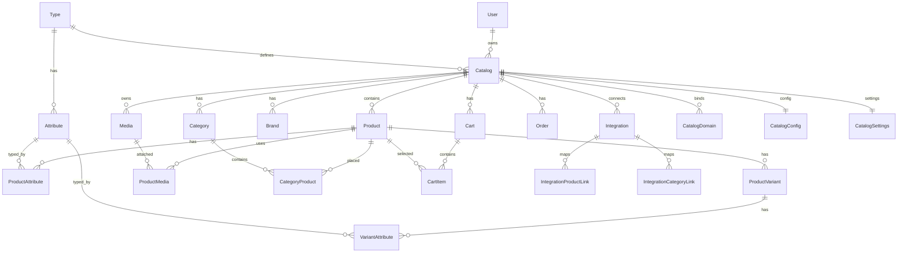

Главная мысль модели: `Catalog` - центр почти всех связей. Это не просто таблица магазинов, а tenant-root, от которого расходятся товары, медиа, корзины, домены, интеграции, SEO, метрики и права доступа.

## 5. Мультикаталожность и tenant context

Мультикаталожность реализована через `CatalogContextMiddleware`, `CatalogResolver`, `RequestContext` и `CatalogGuard`.

Как работает запрос:

1. Запрос приходит в backend.
2. Middleware нормализует host: убирает протокол, порт, `www`, приводит к lowercase.
3. Если route платформенный (`/metrics`, `/observability/health`, docs), каталог пропускается.
4. Если host похож на `{slug}.{baseDomain}`, извлекается slug.
5. `CatalogResolver` ищет каталог по slug.
6. Если slug не найден, resolver пробует найти активный custom domain.
7. В `RequestContext` кладутся `requestId`, `host`, `catalogId`, `catalogSlug`, `typeId`, `ownerUserId`, `parentId`.
8. `CatalogGuard` блокирует обычные catalog-routes, если каталог не найден.
9. Сервисы читают `mustCatalogId()` и `mustTypeId()` из контекста.

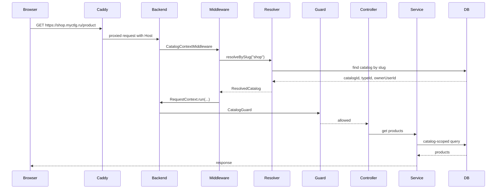

> [!important]
> Почти вся бизнес-логика должна быть catalog-scoped. Если новый сервис читает или пишет доменные данные, он должен либо брать `catalogId` из `RequestContext`, либо явно получать его как параметр в admin/system сценариях.

## 6. Каталоги, типы и атрибуты

### Catalog

`Catalog` хранит:

- `slug` - поддоменный идентификатор;
- `domain` - legacy/full domain fallback;
- `name`;
- связь с `Type`;
- parent/children связь для иерархий;
- owner user;
- promo code;
- subscription end;
- soft-delete поле `deleteAt`;
- связи с продуктами, категориями, брендами, корзинами, заказами, медиа, доменами.

### Type

`Type` описывает тип каталога. Например, одежда и ресторан могут иметь разные наборы атрибутов.

### Attribute

`Attribute` задает структуру данных для товаров:

- строка;
- число;
- decimal;
- boolean;
- datetime;
- enum;
- variant attribute.

Это дает проекту гибкость: backend не нужно менять каждый раз, когда появляется новый тип товара или новый параметр.

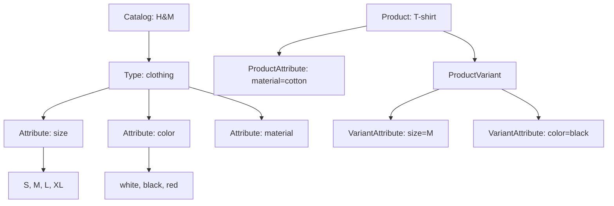

## 7. Товары, варианты, категории и бренды

`ProductModule` - один из самых насыщенных модулей проекта.

Что уже сделано:

- создание товара;
- обновление товара;
- soft-delete;
- дублирование товара;
- переключение статуса;
- переключение `isPopular`;
- чтение по `id`;
- чтение по `slug`;
- infinite pagination;
- card/list форматы;
- рекомендации;
- популярные товары;
- товары без категории;
- позиции внутри категорий;
- связь с брендом;
- связь с медиа;
- синхронизация SEO при изменениях.

Product write-flow:

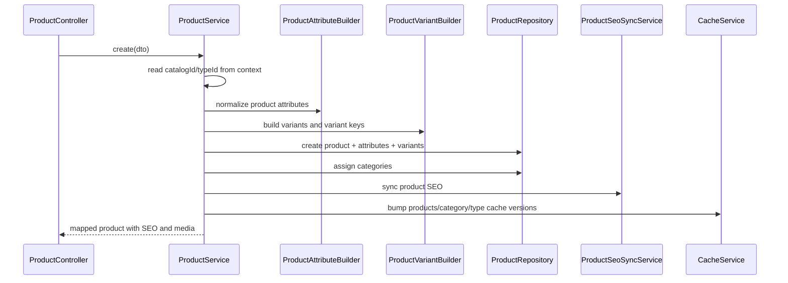

Важные детали:

- `slug` создается через `slugify`;
- SKU нормализуется и защищается от конфликтов;
- duplicate получает суффикс копии;
- кеш версионируется по каталогам и категориям;
- product read-слой вынесен отдельно в `ProductReadService`;
- медиа мапятся через `ProductMediaMapper` и `MediaUrlService`;
- SEO подтягивается через `SeoRepository`.

Категории:

- могут содержать товары через `CategoryProduct`;
- имеют позиции;
- имеют separate endpoints для infinite product lists;
- могут возвращать карточки товаров и полные данные.

Бренды:

- вынесены в `BrandModule`;
- привязаны к catalog;
- участвуют в продуктовой карточке и фильтрации.

## 8. Медиа, S3 и очередь обработки изображений

Работа с медиа выросла из простого S3-модуля в полноценный pipeline.

Что есть:

- presigned upload;
- presigned POST upload;
- multipart upload;
- abort multipart;
- complete multipart;
- queue complete;
- проверка upload queue job;
- генерация вариантов изображений через `sharp`;
- хранение `Media` и `MediaVariant`;
- связь product-media;
- media URL service для отдачи правильных размеров;
- поддержка raw object storage;
- BullMQ worker для асинхронной обработки;
- observability для очередей.

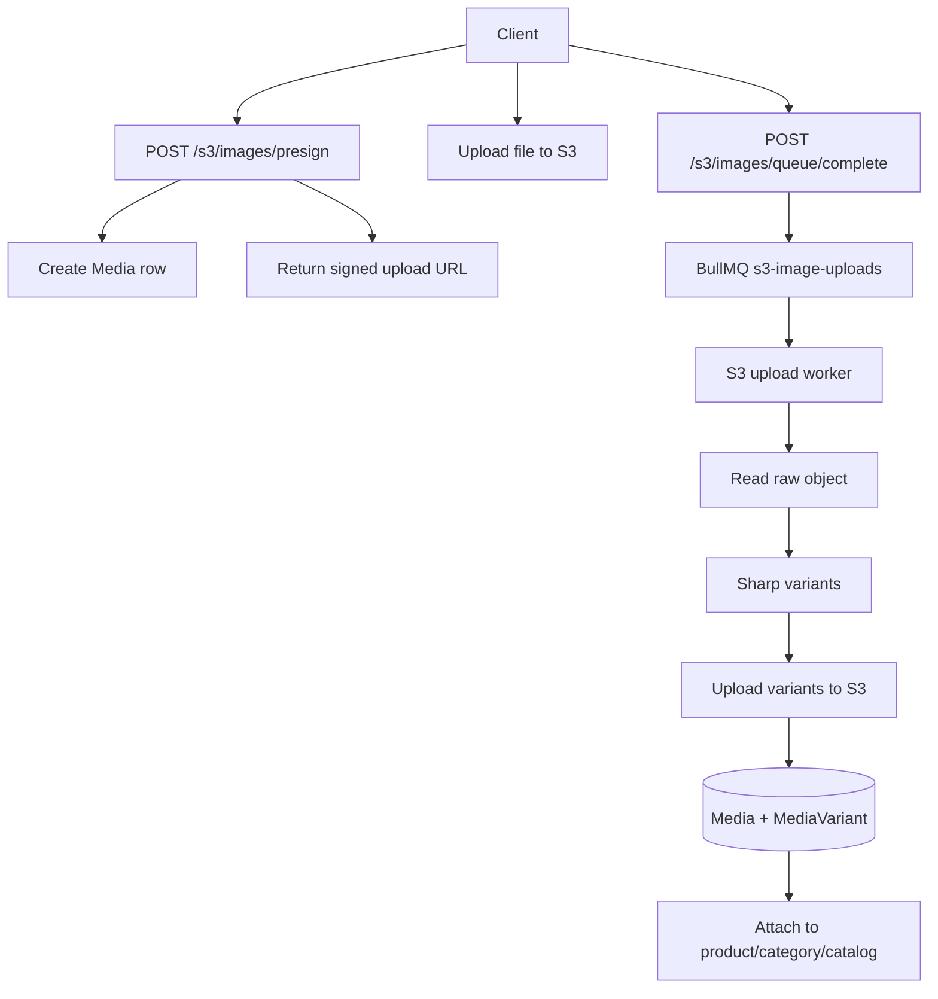

Почему это важно:

- backend не держит тяжелую обработку в HTTP request;
- большие файлы можно грузить multipart-ом;
- оригиналы и варианты разделены;
- товары получают оптимальные изображения для карточек, detail-страниц и thumb.

## 9. SEO

SEO вынесено в отдельный `SeoModule` и таблицу `SeoSetting`.

Реализовано:

- CRUD SEO settings;
- поиск SEO по entity type и entity id;
- поддержка og/twitter media;
- синхронизация SEO при изменении product;
- синхронизация SEO каталога;
- отдельные unit tests для сервиса, репозитория и controller.

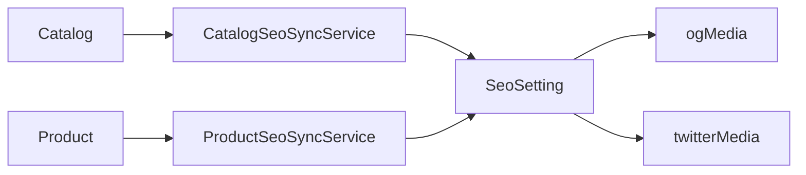

## 10. Корзина и публичный сценарий менеджера

`CartModule` стал отдельным доменным сценарием, а не просто списком товаров.

Что есть:

- текущая корзина по cookie token;
- создание или получение текущей корзины;
- добавление/обновление товаров;
- удаление товаров;
- публичная ссылка `publicKey`;
- manager start/heartbeat/release/complete;
- статусы корзины: draft/shared/in_progress/paused/converted/cancelled/expired;
- SSE события;
- Redis pub/sub для синхронизации событий;
- Redis stream для replay событий;
- таймеры очистки неактивных manager sessions;
- таймеры expiration abandoned draft carts;
- нормализация товаров для будущего заказа.

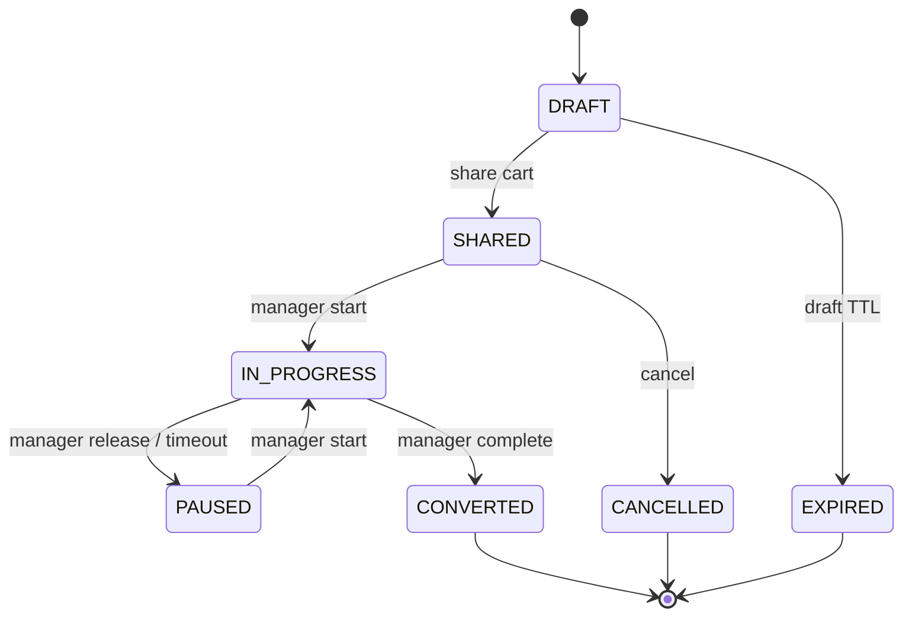

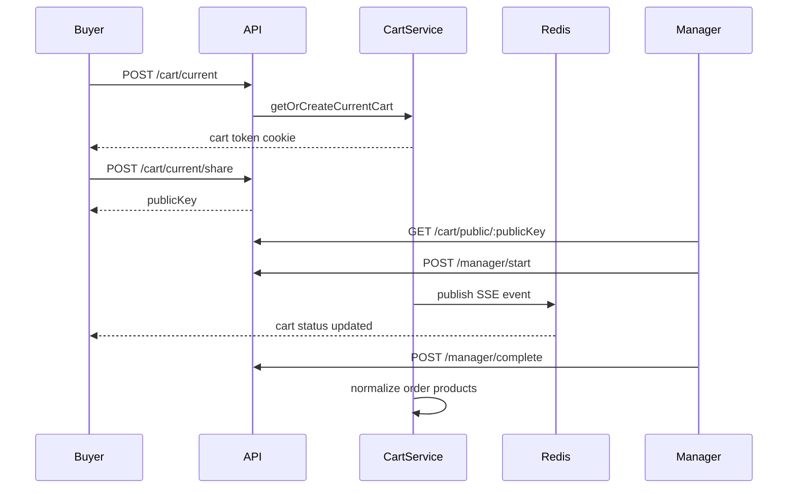

## 11. Авторизация, сессии и защита

Auth-слой включает admin-login и catalog-login.

Что сделано:

- login/logout;
- `me`;
- change password;
- catalog auth;
- управление sessions;
- revoke other sessions;
- revoke конкретной session;
- session reuse;
- CSRF token;
- cookie utils;
- session service;
- catalog visibility utils;
- Redis lockout по IP;
- auth metrics в observability;
- throttling через `CustomThrottlerGuard`;
- отдельный admin session cookie и обычный session cookie.

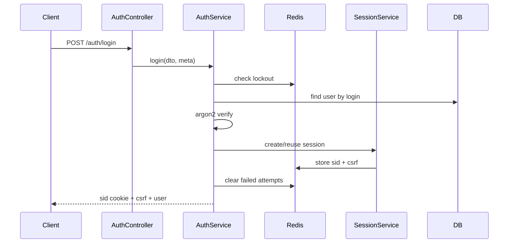

> [!note]
> В app-level throttling tracker используется session cookie, а для анонимных пользователей строится fingerprint из IP, user-agent и accept-language. Это снижает шанс случайно объединять всех пользователей за одним адресом.

## 12. Интеграция МойСклад

Интеграция с МойСклад вынесена в `IntegrationModule` и provider `moysklad`.

Есть:

- get integration config;
- get status;
- get sync runs;
- update config;
- delete integration;
- test connection;
- sync catalog;
- sync one product;
- cancel sync;
- metadata crypto;
- queue service;
- client service;
- sync service;
- отдельные tests для client, metadata, queue, sync, controller, service.

Что синхронизируется:

- товары;
- услуги;
- bundles;
- product folders как категории;
- цены;
- остатки;
- статусы;
- изображения;
- external links;
- sync runs.

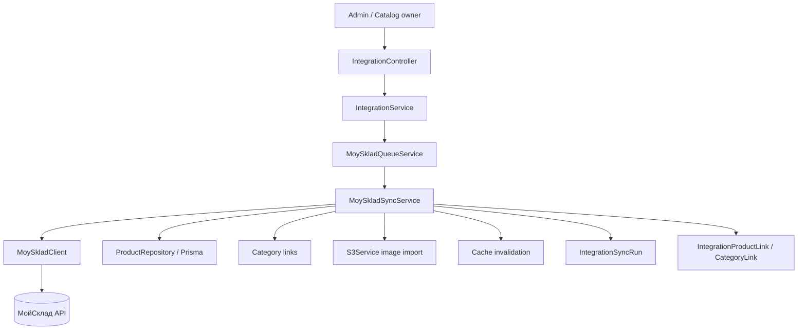

Принцип защиты от конфликтов:

- внешняя сущность мапится через `IntegrationProductLink` или `IntegrationCategoryLink`;
- slug/SKU строятся из внешних данных и защищаются суффиксами/хешем;
- sync-lock ограничивает параллельные синхронизации;
- картинки импортируются через S3Service;
- cache версионируется после изменений.

## 13. Админка, платежи, промокоды и управление каталогами

`AdminModule` появился как слой управления платформой.

Что есть:

- список каталогов;
- создание каталога;
- дублирование каталога;
- обновление каталога;
- soft-delete;
- restore;
- список типов;
- список activities;
- создание activities;
- промокоды;
- платежи каталога;
- платежи промокода;
- promo payments;
- subscription payments;
- SSO/handoff в каталог.

При создании каталога админка делает несколько вещей в одной transaction:

1. Нормализует или генерирует slug.
2. Генерирует login владельца.
3. Генерирует пароль.
4. Создает owner user с ролью `CATALOG`.
5. Создает catalog.
6. Создает config/settings.
7. Подключает метрики.
8. Возвращает данные владельца и каталога.

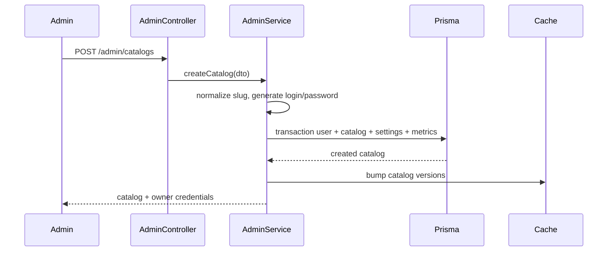

## 14. Кастомные домены, Caddy и TLS

Кастомные домены оформлены не только в коде, но и в отдельном production runbook: `docs/custom-domains-caddy-nginx-ubuntu.md`.

Backend-часть:

- `CatalogDomain`;
- `CatalogDomainController`;
- `CatalogDomainService`;
- DNS TXT verification;
- A/AAAA/CNAME проверки;
- status: `PENDING_DNS`, `ACTIVE`, `FAILED`, `DISABLED`;
- primary domain;
- redirect to primary;
- include www;
- internal TLS ask endpoint для Caddy;
- cron-check pending domains.

Infrastructure-часть:

- Caddy как публичный TLS reverse proxy;
- Nginx rollback path;
- Ubuntu deployment;
- Bun installation;
- systemd backend service;
- DNS инструкции;
- Caddy `ask` endpoint;
- логирование и проверка TLS;
- backup и rollback план.

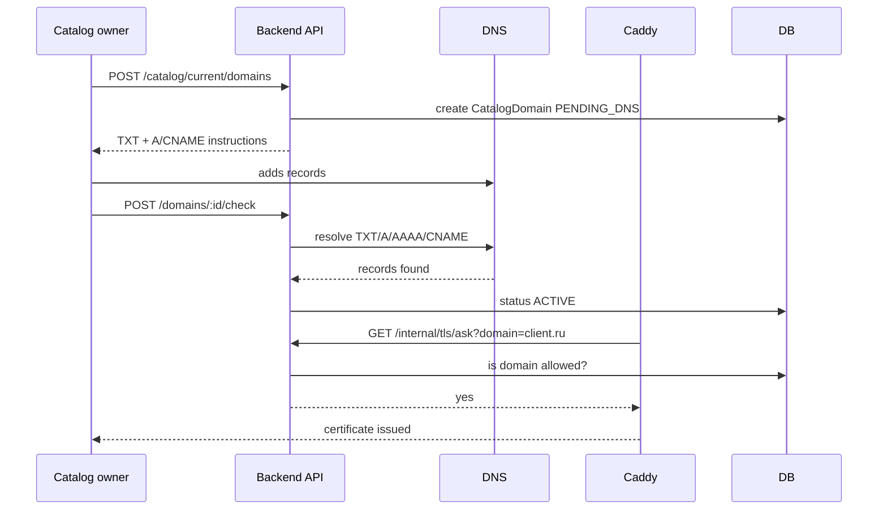

## 15. Observability

Observability слой сделан как комбинация app instrumentation и отдельного docker overlay.

App-side:

- `ObservabilityModule`;
- `/metrics`;
- `/observability/health`;
- HTTP metrics;
- in-flight gauge;
- request duration histogram;
- cron metrics;
- queue metrics;
- cache metrics;
- Prisma slow query metrics;
- auth/security events;
- admin action metrics;
- JSON logger;
- requestId;
- OpenTelemetry auto-instrumentation;
- OTLP HTTP exporter.

Infra-side:

- Grafana;
- Loki;
- Tempo;
- Mimir;
- Alloy;
- dashboards: Backend Overview, Auth Overview, Operations Overview;
- alerting provisioning;
- datasource provisioning;
- logrotate config.

```mermaid
flowchart TD
    Backend[NestJS backend] --> Metrics[/metrics]
    Backend --> JsonLogs[runtime/logs/backend.jsonl]
    Backend --> OTLP[OTLP traces]
    Metrics --> Alloy[Grafana Alloy]
    JsonLogs --> Alloy
    OTLP --> Alloy
    Alloy --> Mimir[(Mimir metrics)]
    Alloy --> Loki[(Loki logs)]
    Alloy --> Tempo[(Tempo traces)]
    Mimir --> Grafana[Grafana dashboards]
    Loki --> Grafana
    Tempo --> Grafana
```

> [!tip]
> Главная ценность этого слоя - можно связать `requestId`, `traceId`, логи, метрики HTTP, slow Prisma queries, auth события и queue jobs в одном debugging flow.

## 16. Legacy migration и backfill

В проекте есть отдельный `migration` слой.

Команды:

```bash
bun run legacy:migrate
bun run legacy:migrate:all
bun run legacy:backfill-media-maps
```

Основной migration pipeline:

- `catalog-bootstrap`;
- `payments`;
- `orders`;
- `products`;
- `media`;
- `seo`;
- `report`.

Скрипт умеет:

- работать в dry-run режиме;
- работать в apply режиме;
- фильтровать по business ids/hosts;
- писать `MigrationRun`;
- писать `MigrationIssue`;
- писать `MigrationEntityMap`;
- подключаться к target DB и legacy DB;
- вести structured legacy events;
- собирать reconciliation report.

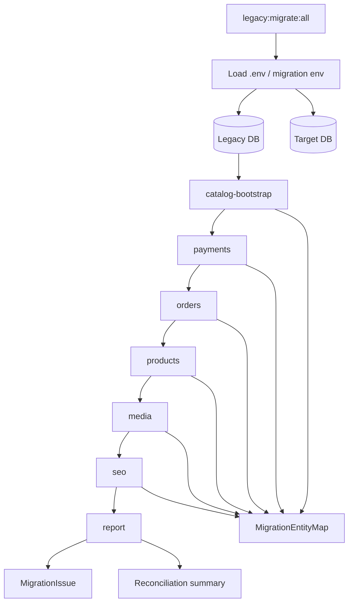

### Backfill media maps

Отдельный скрипт `migration/scripts/backfill-media-maps.ts` нужен для восстановления недостающих `migration_entity_maps` строк для `entity=MEDIA`.

Он:

- не скачивает изображения;
- не загружает изображения заново;
- создает только недостающие MEDIA maps;
- сохраняет существующие валидные MEDIA maps;
- конфликтующие MEDIA maps пропускает;
- product images сопоставляет по `ProductMedia.position`;
- category images сопоставляет по `Category.imageMediaId`;
- catalog logo/background сопоставляет по `CatalogConfig.logoMediaId/bgMediaId`.

PM2 запуск apply:

```bash
pm2 start bun --name legacy-backfill-media-maps --no-autorestart --time -- run legacy:backfill-media-maps -- --apply
```

Dry-run:

```bash
pm2 start bun --name legacy-backfill-media-maps-dry --no-autorestart --time -- run legacy:backfill-media-maps
```

## 17. Тесты и качество

В проекте есть 50 `*.spec.ts` файлов.

Покрыты:

- auth service;
- auth cookies;
- catalog visibility;
- cart controller/service;
- product controller/service/repository/search/attribute builder/SEO sync;
- category controller/service/repository;
- seo controller/service/repository;
- s3 controller/service;
- integration controller/service/moysklad client/metadata/queue/sync;
- observability settings/interceptor/utils;
- prisma observability;
- throttler decorator;
- tenant context middleware;
- media select;
- global exception filter;
- metrics/payment/order/regionality/activity/attribute/cron.

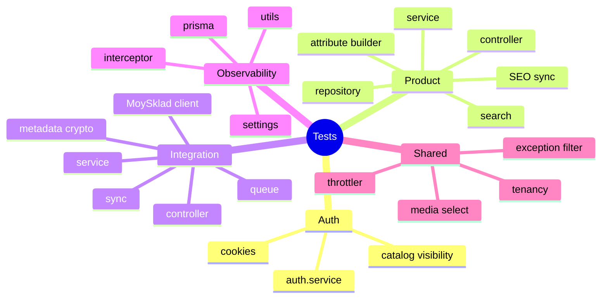

## 18. Команды запуска

Основные scripts из `package.json`:

```bash
bun run build
bun run start
bun run start:dev
bun run start:prod
bun run test
bun run test:e2e
bun run lint
bun run prisma:push
bun run prisma:generate
bun run admin:create
bun run legacy:migrate
bun run legacy:migrate:all
bun run legacy:backfill-media-maps
```

Observability stack:

```bash
docker compose -f docker-compose.yml -f docker-compose.observability.yml up -d
```

PM2 backfill:

```bash
pm2 start bun --name legacy-backfill-media-maps --no-autorestart --time -- run legacy:backfill-media-maps -- --apply
pm2 logs legacy-backfill-media-maps
pm2 status
```

## 19. Что важно помнить дальше

> [!warning]
> Самый важный invariant проекта: catalog context должен быть корректным. Если route не platform/admin/system route, он должен либо резолвиться в каталог, либо явно быть помеченным как skip catalog.

Технические правила, которые уже видны по коду:

- новые доменные запросы должны учитывать `catalogId`;
- write-flow после изменения товаров/категорий/медиа должен инвалидировать cache versions;
- SEO лучше синхронизировать рядом с изменением entity;
- медиа лучше проводить через `MediaRepository`, `MediaUrlService`, `S3Service`;
- интеграции должны писать external links, а не пытаться угадывать соответствия каждый раз;
- миграции должны иметь dry-run и не перетирать конфликтующие данные;
- observability должна оставаться отключаемой через env, но код не должен удаляться;
- custom domain flow должен оставаться проверяемым через DNS и Caddy ask endpoint.

Потенциальные следующие узлы для отдельных Obsidian-заметок:

- [[Catalog Context]]
- [[Product Write Flow]]
- [[S3 Image Pipeline]]
- [[MoySklad Sync Algorithm]]
- [[Cart SSE Flow]]
- [[Custom Domain Verification]]
- [[Observability Debugging Flow]]
- [[Legacy Migration Pipeline]]
- [[Cache Versioning]]
- [[Auth Session Model]]

## 20. Obsidian graph

Эта секция специально сделана как стартовая карта для графа.

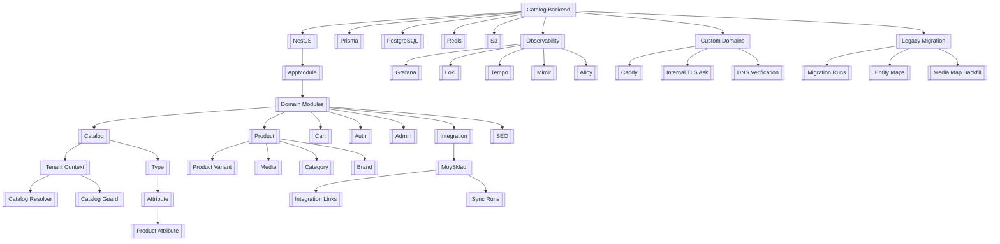

Dataview-заготовки для Obsidian:

```dataview
LIST
FROM #catalog/backend
SORT file.name ASC
```

```dataview
TABLE created, source
FROM #catalog/architecture
SORT created DESC
```

Поисковые tags:

- `#catalog/backend`
- `#catalog/architecture`
- `#nestjs`
- `#prisma`
- `#observability`
- `#legacy-migration`
- `#custom-domains`

## Короткое резюме

Проект прошел путь от NestJS starter-а до production-oriented backend-платформы для мультикаталожных витрин. Основной результат - не просто набор CRUD endpoints, а связанная система: catalog context, гибкая атрибутная модель, товары с вариантами и медиа, S3 pipeline, SEO, корзина с публичным менеджерским сценарием, auth/session слой, МойСклад-интеграция, админка, custom domains через Caddy, observability stack и фазовая legacy migration.

Главный граф проекта выглядит так:

```mermaid
flowchart LR
    Tenant[Catalog/Tenant] --> Schema[Type + Attributes]
    Schema --> Products[Products + Variants]
    Products --> Media[S3 Media]
    Products --> SEO[SEO]
    Products --> Cart[Cart]
    Cart --> Orders[Orders]
    Products --> Integration[MoySklad Sync]
    Tenant --> Domains[Custom Domains]
    Tenant --> Admin[Admin Management]
    Backend[NestJS Backend] --> Observability[Metrics + Logs + Traces]
    Legacy[Legacy DB] --> Migration[Migration Pipeline]
    Migration --> Tenant
    Migration --> Products
    Migration --> Media
```
