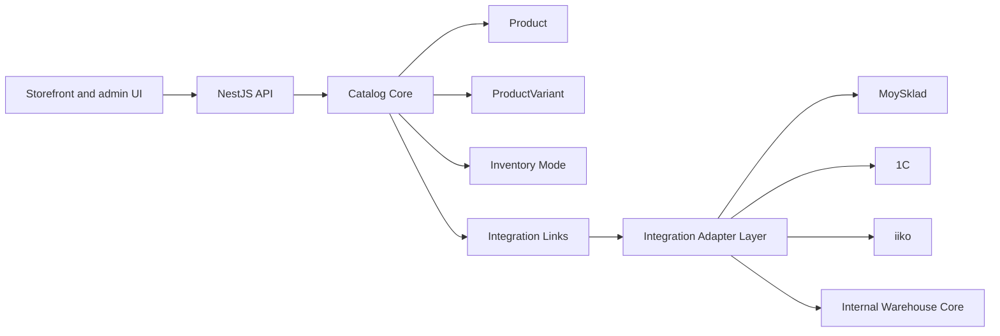
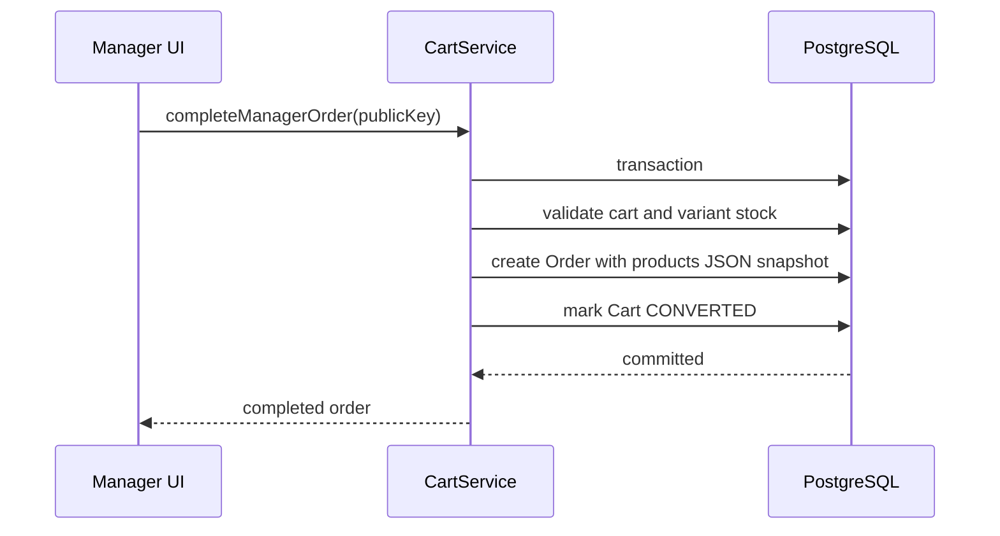
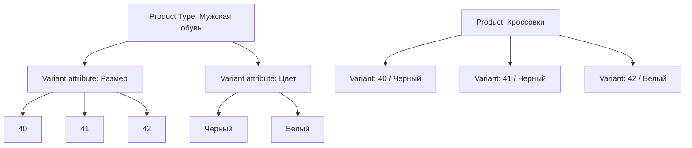
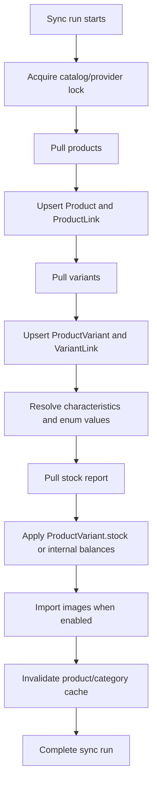
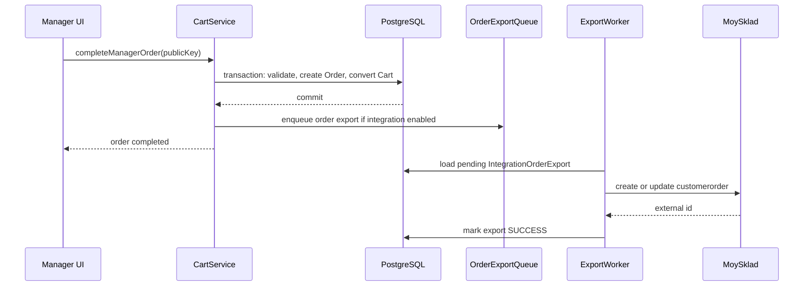

# Product Variants, Inventory and Integrations Architecture

> [!summary]
> Этот документ описывает целевую архитектуру модификаций товара, складского учета и интеграций для `catalog`. Главная идея: витрина, корзина и UX работают от нашей нормализованной модели, внешние системы подключаются через адаптеры, а собственный склад включается только по тарифу и не создает складские сущности для всех каталогов.

## 1. Executive Summary

Целевая система должна выдержать несколько разных режимов бизнеса:

- обычный каталог без склада;
- каталог, который берет товары, цены и остатки из МойСклад;
- будущие интеграции с 1С, iiko и другими учетными системами;
- собственный складской контур платформы для старшего тарифа;
- гибкие вариации, которые владелец каталога может настраивать под свою предметную область.

Ключевой принцип: **наш каталог является source of truth для витрины**. Это не означает, что владелец руками редактирует все данные. Это означает, что frontend, корзина, поиск, карточки товаров, SEO, рекомендации и заказы читают из нашей модели `Product` + `ProductVariant`, а МойСклад/1С/iiko/внутренний склад работают через слой синхронизации и ссылок.

Внешние системы не должны диктовать форму UX. МойСклад использует `product`, `variant`, `assortment`, stock reports и свои ограничения API. 1С и iiko будут иметь другие модели. Если привязать витрину напрямую к формату конкретного провайдера, дальнейшее развитие станет хрупким. Поэтому нужен слой:



Варианты товара должны стать главным purchase-level объектом. `Product` отвечает за карточку и группировку. `ProductVariant` отвечает за покупаемую SKU: цену, остаток, доступность, внешнюю связь и выбранные характеристики.

Собственный склад не должен включаться всем. Для большинства каталогов достаточно `NONE` или `EXTERNAL` режима, где актуальный остаток лежит в `ProductVariant.stock`. Полноценные таблицы склада, движения, резервы и инвентаризация появляются только в режиме `INTERNAL`, который закрыт тарифом.

## 2. Existing Architecture

### 2.1 Backend foundation

Текущий backend уже имеет хороший фундамент:

- NestJS 11 как модульный API layer.
- Prisma 7 и PostgreSQL как основное хранилище.
- Redis для cache/throttling/SSE/queues.
- BullMQ для фоновых задач МойСклад.
- S3/media pipeline для изображений.
- Tenant context через catalog middleware/guard/resolver.
- Версионированные cache keys для товаров и категорий.
- Observability: metrics, JSON logs, tracing, queue metrics.

Текущие важные файлы и зоны:

- `prisma/schema/product.prisma`: `Product`, `ProductVariant`, `ProductAttribute`, `ProductMedia`.
- `prisma/schema/attribute.prisma`: `Attribute`, `AttributeEnumValue`, `VariantAttribute`.
- `prisma/schema/cart.prisma`: `Cart`, `CartItem`, включая `variantId`.
- `prisma/schema/integration.prisma`: `Integration`, links, sync runs.
- `src/modules/product`: product read/write, variant builder, repository.
- `src/modules/cart/cart.service.ts`: корзина, менеджерский сценарий, локальное создание `Order`.
- `src/modules/integration/providers/moysklad`: клиент, очередь, sync, metadata crypto.
- `src/modules/catalog/catalog-advanced-settings.*`: настройки интеграций в advanced settings.

### 2.2 Product and variant model today

Сейчас модель уже содержит сущности, которые нужны для вариаций:

- `Product` хранит карточку товара: `catalogId`, `brandId`, `sku`, `name`, `slug`, `price`, `status`, `position`.
- `ProductVariant` хранит вариант: `productId`, `sku`, `variantKey`, `stock`, `price`, `status`, `isAvailable`.
- `Attribute` задает поле типа каталога и имеет флаг `isVariantAttribute`.
- `AttributeEnumValue` хранит enum-значения атрибута.
- `VariantAttribute` связывает вариант с enum-значением атрибута.
- `ProductAttribute` хранит не-вариантные атрибуты карточки.

Это правильное направление. Главный недостаток не в схеме вариантов, а в том, что purchase-flow еще не до конца живет на вариантах.

### 2.3 Current gap: price and order snapshot

В текущем `CartService` важная часть расчетов идет от `item.product.price`. При завершении менеджерского заказа snapshot также берет unit price из `Product.price`. При этом в модели уже есть `ProductVariant.price`, `ProductVariant.stock` и `CartItem.variantId`.

Целевой invariant:

- если `variantId` выбран, цена покупки берется из `ProductVariant.price`;
- `Product.price` используется для карточки, сортировки, фильтров и fallback, но не как единственный источник цены покупки;
- order snapshot сохраняет выбранный вариант, его характеристики и цену на момент оформления;
- разные варианты одного товара являются разными строками корзины.

Это изменение требует аккуратного совместимого перехода. Нельзя просто переключить расчеты и сломать каталоги, где у товара пока нет вариантов или `variantId` не передается фронтом.

### 2.4 Cart and order flow today

Текущая корзина уже учитывает `variantId` на уровне DTO и `CartItem`, а при добавлении проверяет, что вариант принадлежит товару. Проверка остатка делается через `ProductVariant.stock` и `isAvailable`.

Текущий локальный менеджерский сценарий:



Целевой сценарий добавляет async export в МойСклад после локального commit, не смешивая внешний API в транзакцию.

### 2.5 MoySklad integration today

Сейчас есть:

- `Integration` с provider `MOYSKLAD` и encrypted metadata.
- `IntegrationProductLink` для связи внешнего товара с нашим `Product`.
- `IntegrationCategoryLink` для связей product folders с категориями.
- `IntegrationSyncRun` для истории и статусов sync.
- `MoySkladClient`, который умеет читать ассортимент, продукты, изображения, папки, stock all.
- `MoySkladQueueService`, который ставит full/product sync в BullMQ и поддерживает scheduler.
- `MoySkladSyncService`, который импортирует ассортимент, категории, изображения, цены и статусы.

Текущий sync уже полезен, но для мощной системы нужно развести три разные вещи:

- карточки товаров и категорий;
- модификации и их характеристики;
- остатки и складскую детализацию.

МойСклад в JSON API 1.2 имеет отдельную сущность `variant` для модификаций, а stock reports возвращают остатки через ассортиментные идентификаторы. Поэтому целевой sync не должен рассматривать `Product` как единственный покупаемый объект.

## 3. Product Types and Variations

### 3.1 Problem

Глобальные фиксированные значения вариаций создают хаос. Пример:

- одежда хочет размеры `XS`, `S`, `M`, `L`;
- мужская обувь хочет `40`, `41`, `42`;
- кофе хочет `250 мл`, `350 мл`, `450 мл`;
- пицца хочет `25 см`, `30 см`, `35 см`;
- автозапчасти хотят `левый`, `правый`, `OEM`, `аналог`.

Если сделать общий глобальный список значений, он быстро станет мусорным: одинаковые слова будут значить разное, порядок будет спорным, разные бизнесы будут ломать друг другу UX. Если разрешить свободный текст в каждой модификации, интеграции и фильтры начнут расползаться.

Правильная модель: **управляемые справочники значений, scoped к каталогу, типу товара и атрибуту**.

### 3.2 Target concepts

Текущие `Type` и `Attribute` задают тип каталога. Для более мощной системы нужен дополнительный уровень: **product type внутри каталога**.

Пример:

- catalog type: `clothing`;
- catalog: `Sneaker Store`;
- product type: `Мужская обувь`;
- variant attributes: `Размер`, `Цвет`;
- enum values for `Размер`: `40`, `41`, `42`, `43`;
- enum values for `Цвет`: `Черный`, `Белый`, `Коричневый`.

Другой каталог может иметь свой `Мужская обувь`, свои размеры, порядок и алиасы. Можно дать стартовые шаблоны, но не делать значения жестко глобальными.

### 3.3 Proposed data model direction

Текущую модель не нужно ломать. Ее нужно расширить:

```prisma
enum ProductTypeScope {
  SYSTEM_TEMPLATE
  CATALOG
}

model ProductType {
  id          String @id @default(uuid()) @db.Uuid
  catalogId   String? @map("catalog_id") @db.Uuid
  code        String @db.VarChar(100)
  name        String @db.VarChar(255)
  scope       ProductTypeScope
  isArchived  Boolean @default(false) @map("is_archived")
  createdAt   DateTime @default(now()) @map("created_at")
  updatedAt   DateTime @updatedAt @map("updated_at")
}

model ProductTypeAttribute {
  productTypeId String @map("product_type_id") @db.Uuid
  attributeId   String @map("attribute_id") @db.Uuid
  isVariant     Boolean @default(false) @map("is_variant")
  isRequired    Boolean @default(false) @map("is_required")
  displayOrder  Int @default(0) @map("display_order")

  @@id([productTypeId, attributeId])
}
```

Для `AttributeEnumValue` нужны расширения:

- `catalogId` или scope owner, если значение должно быть строго каталоговым;
- `aliases` или отдельная таблица `AttributeEnumValueAlias`;
- `isArchived` вместо физического удаления;
- `source` или `origin`: manual, import, template;
- `mergeTargetId`, если значение было объединено;
- `external mappings` через integration link table.

Возможный эскиз:

```prisma
model AttributeEnumValueAlias {
  id          String @id @default(uuid()) @db.Uuid
  enumValueId String @map("enum_value_id") @db.Uuid
  alias       String @db.VarChar(255)
  normalized  String @db.VarChar(255)
  source      String? @db.VarChar(50)

  @@unique([enumValueId, normalized])
  @@index([normalized])
}
```

### 3.4 Normalization and anti-chaos rules

Правила справочников:

- новые значения не пишутся строкой напрямую в `VariantAttribute`;
- при вводе значения система нормализует его: trim, NFKC, lower-case, замена `ё/е` в поисковом ключе, удаление лишних пробелов;
- если похожее значение уже есть, UI предлагает выбрать существующее;
- если значение импортировано из внешней системы, оно попадает в preview перед применением или создается как `origin=import` с пометкой для ревью;
- удаление заменяется архивированием;
- merge сохраняет историю, чтобы старые товары и заказы не потеряли смысл;
- порядок отображения хранится явно, а не сортируется случайно по алфавиту.

### 3.5 Variant generation

Матрица вариантов строится из variant attributes product type.

Пример:



Важно: не обязательно создавать полный декартов набор. Владелец может создать только существующие комбинации.

### 3.6 Default variant

Каждый товар должен иметь хотя бы один покупаемый вариант:

- если у товара нет вариаций, создается default variant;
- default variant имеет `variantKey = "default"` или системный stable key;
- корзина и заказ всегда работают через `variantId`;
- публичный API может скрывать default variant от UX, но не от backend logic.

Это упростит:

- расчет цены;
- проверку остатка;
- экспорт заказа;
- будущий warehouse core;
- интеграции.

## 4. Inventory Modes

### 4.1 Why inventory must be mode-based

Собственный склад будет доступен только на тарифе выше. Поэтому нельзя создавать склад каждому каталогу и нельзя делать warehouse-таблицы обязательными для базового UX.

Целевой подход: catalog inventory mode.

```prisma
enum CatalogInventoryMode {
  NONE
  EXTERNAL
  INTERNAL
}
```

Где хранить режим:

- быстрый вариант: в `CatalogSettings.checkout` или отдельном JSON settings поле;
- правильный долгосрочный вариант: явное поле `inventoryMode` в `CatalogSettings`;
- тарифный доступ: отдельный entitlement layer поверх `subscriptionEndsAt` и payment metadata.

### 4.2 Mode NONE

`NONE` подходит для обычных каталогов без складского учета.

Поведение:

- нет `Warehouse`;
- нет `StockBalance`;
- нет `Reservation`;
- нет `InventoryMovement`;
- товар можно вести вручную;
- `ProductVariant.stock` может использоваться как простой лимит или быть отключен настройкой;
- UI склада скрыт.

Этот режим должен быть самым дешевым и самым легким.

### 4.3 Mode EXTERNAL

`EXTERNAL` означает, что остатки приходят из внешней системы.

Поведение:

- складские сущности нашей системы не создаются автоматически;
- `ProductVariant.stock` обновляется из МойСклад/1С/iiko;
- можно хранить внешний складской mapping, если он нужен для фильтра или экспорта;
- purchase-flow проверяет `ProductVariant.stock`;
- управление остатками в UI ограничено или read-only.

Это режим для текущего МойСклад сценария.

### 4.4 Mode INTERNAL

`INTERNAL` включает наш собственный складской контур и доступен только по тарифу.

Сущности:

```prisma
model InventoryWarehouse {
  id        String @id @default(uuid()) @db.Uuid
  catalogId String @map("catalog_id") @db.Uuid
  name      String @db.VarChar(255)
  code      String? @db.VarChar(100)
  isActive  Boolean @default(true) @map("is_active")
  createdAt DateTime @default(now()) @map("created_at")
  updatedAt DateTime @updatedAt @map("updated_at")
}

model InventoryStockBalance {
  id          String @id @default(uuid()) @db.Uuid
  catalogId   String @map("catalog_id") @db.Uuid
  warehouseId String @map("warehouse_id") @db.Uuid
  variantId   String @map("variant_id") @db.Uuid
  onHand      Int @default(0) @map("on_hand")
  reserved    Int @default(0)
  available   Int @default(0)
  updatedAt   DateTime @updatedAt @map("updated_at")

  @@unique([warehouseId, variantId])
  @@index([catalogId, variantId])
}

model InventoryReservation {
  id          String @id @default(uuid()) @db.Uuid
  catalogId   String @map("catalog_id") @db.Uuid
  variantId   String @map("variant_id") @db.Uuid
  cartId      String? @map("cart_id") @db.Uuid
  orderId     String? @map("order_id") @db.Uuid
  quantity    Int
  status      String @db.VarChar(50)
  expiresAt   DateTime? @map("expires_at")
  createdAt   DateTime @default(now()) @map("created_at")
  updatedAt   DateTime @updatedAt @map("updated_at")
}

model InventoryMovement {
  id          String @id @default(uuid()) @db.Uuid
  catalogId   String @map("catalog_id") @db.Uuid
  warehouseId String? @map("warehouse_id") @db.Uuid
  variantId   String @map("variant_id") @db.Uuid
  type        String @db.VarChar(50)
  quantity    Int
  reason      String? @db.VarChar(255)
  sourceType  String? @map("source_type") @db.VarChar(50)
  sourceId    String? @map("source_id") @db.VarChar(100)
  createdAt   DateTime @default(now()) @map("created_at")
}
```

Это эскиз, не финальная Prisma-схема. Финальная схема должна пройти отдельный migration review.

### 4.5 Entitlement gate

Тарифный gate должен жить на backend, а не только в UI.

Минимум:

- `InventoryEntitlementService.canUseInternalInventory(catalogId)`;
- guard/decorator для warehouse endpoints;
- проверка в service layer перед созданием складов;
- audit log для включения/отключения `INTERNAL`;
- запрет автоматического создания `InventoryWarehouse` при создании каталога.

Источники entitlement в текущей базе:

- `Catalog.subscriptionEndsAt`;
- `Payment.licenseEndsAt`;
- `Payment.metadata`;
- будущая явная модель тарифов.

Рекомендация: не зашивать тарифы только в `Payment.metadata`. Нужен нормализованный слой возможностей:

```prisma
model CatalogFeatureEntitlement {
  id        String @id @default(uuid()) @db.Uuid
  catalogId String @map("catalog_id") @db.Uuid
  feature   String @db.VarChar(100)
  enabled   Boolean @default(false)
  expiresAt DateTime? @map("expires_at")
  metadata  Json?

  @@unique([catalogId, feature])
}
```

Feature key для склада: `inventory.internal`.

## 5. Integration Adapter Layer

### 5.1 Goal

Интеграции должны быть подключаемыми адаптерами. Ядро каталога не должно знать детали МойСклад, 1С или iiko.

Целевой интерфейс:

```ts
type ExternalProduct = {
  externalId: string
  externalCode?: string | null
  name: string
  description?: string | null
  archived?: boolean
  updatedAt?: Date | null
  categoryRefs?: ExternalCategoryRef[]
  imageRefs?: ExternalImageRef[]
  raw: unknown
}

type ExternalVariant = {
  externalId: string
  parentExternalProductId: string
  sku?: string | null
  name?: string | null
  price?: number | null
  characteristics: Array<{ name: string; value: string }>
  barcodes?: string[]
  archived?: boolean
  updatedAt?: Date | null
  raw: unknown
}

type ExternalStockBalance = {
  externalVariantId: string
  externalWarehouseId?: string | null
  onHand?: number
  reserve?: number
  available: number
  updatedAt?: Date | null
  raw: unknown
}

interface InventoryIntegrationAdapter {
  provider: IntegrationProvider
  testConnection(): Promise<void>
  pullProducts(cursor?: SyncCursor): AsyncIterable<ExternalProduct>
  pullVariants(cursor?: SyncCursor): AsyncIterable<ExternalVariant>
  pullStock(params: StockPullParams): Promise<ExternalStockBalance[]>
  pullPrices?(params: PricePullParams): Promise<ExternalPrice[]>
  pushOrder?(order: OrderExportPayload): Promise<OrderExportResult>
}
```

### 5.2 Links and identity

Нельзя постоянно угадывать соответствие по `name` или `sku`. Нужны стабильные link tables.

Уже есть:

- `IntegrationProductLink`;
- `IntegrationCategoryLink`.

Нужно добавить:

- `IntegrationVariantLink`;
- `IntegrationWarehouseLink`;
- `IntegrationOrderExport`;
- опционально `IntegrationAttributeValueLink` для внешних значений характеристик.

Эскиз:

```prisma
model IntegrationVariantLink {
  id String @id @default(uuid()) @db.Uuid

  integrationId String @map("integration_id") @db.Uuid
  variantId     String @map("variant_id") @db.Uuid

  externalId        String @map("external_id") @db.VarChar(64)
  externalCode      String? @map("external_code") @db.VarChar(100)
  externalUpdatedAt DateTime? @map("external_updated_at")
  rawMeta           Json? @map("raw_meta")

  @@unique([integrationId, externalId])
  @@unique([integrationId, variantId])
  @@index([variantId])
}

model IntegrationOrderExport {
  id String @id @default(uuid()) @db.Uuid

  integrationId String @map("integration_id") @db.Uuid
  orderId       String @map("order_id") @db.Uuid
  provider      IntegrationProvider
  idempotencyKey String @unique @map("idempotency_key") @db.VarChar(191)

  externalId String? @map("external_id") @db.VarChar(100)
  status     String @db.VarChar(50)
  attempts   Int @default(0)
  lastError  String? @map("last_error") @db.Text
  payload    Json?
  response   Json?

  requestedAt DateTime @default(now()) @map("requested_at")
  exportedAt  DateTime? @map("exported_at")
  createdAt   DateTime @default(now()) @map("created_at")
  updatedAt   DateTime @updatedAt @map("updated_at")

  @@unique([integrationId, orderId])
  @@index([status, requestedAt])
}
```

### 5.3 Sync pipeline

Целевой sync должен быть item-level и restartable:



Для крупных каталогов нужен прогресс:

- total fetched;
- products created/updated/skipped;
- variants created/updated/skipped;
- stock rows applied;
- images imported;
- warnings count;
- hard errors count.

## 6. MoySklad Strategy

### 6.1 Official API facts

По официальной документации МойСклад:

- JSON API доступен для интеграций и имеет лимиты запросов.
- Модификация товара имеет entity keyword `variant`.
- У `variant` есть `characteristics`, `salePrices`, `barcodes`, `product`, `images`, `externalCode`, `updated`.
- Stock reports поддерживают остатки по ассортиментным позициям, включая фильтрацию по `assortmentId` и `storeId`.

Ссылки:

- https://dev.moysklad.ru/
- https://raw.githubusercontent.com/moysklad/api-remap-1.2-doc/master/md/dictionaries/_variant.md
- https://raw.githubusercontent.com/moysklad/api-remap-1.2-doc/master/md/reports/_report_stock.md
- https://raw.githubusercontent.com/moysklad/api-remap-1.2-doc/master/md/_restrictions.md

### 6.2 Product import

`product` в МойСклад должен мапиться в наш `Product`.

Правила:

- `Product.name` из external product name;
- `Product.sku` из stable external code/code/article с fallback и suffix;
- `Product.price` как display/min/base price, но не единственная цена покупки;
- категории из `productFolder`;
- изображения из product images;
- archived product переводит товар в скрытый/архивный статус с учетом ручных статусов.

Нельзя завязывать identity только на `externalCode`. Текущий sync использует `externalCode` как ключ, но долгосрочно link должен хранить `externalId` как основной внешний id, а `externalCode` как полезный бизнес-код.

### 6.3 Variant import

`variant` в МойСклад должен мапиться в наш `ProductVariant`.

Правила:

- `variant.id` -> `IntegrationVariantLink.externalId`;
- `variant.product` -> поиск родительского `Product` через `IntegrationProductLink`;
- `variant.characteristics` -> `VariantAttribute`;
- `variant.salePrices` -> `ProductVariant.price`;
- `variant.barcodes` -> rawMeta или отдельная будущая barcode model;
- `variant.archived` -> `ProductVariantStatus.DISABLED` или archived flag;
- `variant.updated` -> externalUpdatedAt.

Если у МойСклад товара нет модификаций, нужно создать default variant для нашего товара.

### 6.4 Characteristic mapping

МойСклад `characteristics` приходит как пары name/value. У нас это должны быть структурированные атрибуты и enum values.

Алгоритм:

1. Нормализовать имя характеристики.
2. Найти существующий variant attribute в product type/catalog.
3. Если не найден, создать candidate mapping в preview.
4. Нормализовать значение.
5. Найти enum value или alias.
6. Если не найдено, создать candidate enum value или отправить в review queue.
7. После подтверждения применить к variant.

Для автоматического режима можно создавать значения сразу, но обязательно помечать `origin=import` и показывать владельцу каталогов рекомендации по merge.

### 6.5 Stock reports

Остатки нужно синхронизировать отдельно от карточек.

Режим `EXTERNAL`:

- собрать external assortment ids для вариантов;
- запросить stock report;
- посчитать available quantity;
- обновить `ProductVariant.stock`;
- выставить `ProductVariantStatus.ACTIVE` или `OUT_OF_STOCK`, не перетирая ручной `DISABLED`.

Режим `INTERNAL`:

- если МойСклад остается источником остатков, stock report обновляет `InventoryStockBalance`;
- если наш склад является source of truth, МойСклад stock import отключен или read-only для сравнения.

Важно: webhooks МойСклад можно добавить позже как ускоритель, но нельзя делать их единственным механизмом. Нужен periodic reconciliation.

### 6.6 Images

Изображения:

- импортировать с ограничением размера и MIME;
- хранить через существующий `S3Service`;
- не импортировать повторно без необходимости;
- для variants можно начать с product-level изображений, а variant-specific images добавить позже;
- на ошибке image import не валить весь sync товара, если карточка и варианты импортированы.

### 6.7 Rate limit and retry

MoySklad API имеет лимиты, а текущий `MoySkladClient` уже содержит rate-limit window и retry на `429`. Целевые улучшения:

- вынести rate limiter в общий provider-level компонент;
- учитывать `Retry-After`/provider headers;
- писать latency, status, attempt count;
- не держать долгие Prisma transactions во время network/S3 операций;
- на item-level ошибке продолжать sync run и сохранять warning.

## 7. Order Export Flow

### 7.1 Principle

Локальное завершение заказа важнее внешнего экспорта. Нельзя делать так, чтобы временная ошибка МойСклад откатывала заказ в нашем backend.

Правильный порядок:



### 7.2 Idempotency

Нужен idempotency key:

```txt
moysklad:order-export:{integrationId}:{orderId}
```

`IntegrationOrderExport` должен иметь unique constraint на `integrationId + orderId` или unique `idempotencyKey`.

Если worker повторяет задачу:

- сначала проверяет существующий export record;
- если `SUCCESS`, не отправляет повторно;
- если `ERROR`, увеличивает attempts и повторяет;
- если МойСклад вернул внешний id, сохраняет его.

### 7.3 Payload snapshot

Для экспорта заказа нужен snapshot, независимый от будущих изменений товара:

- order id;
- catalog id;
- createdAt;
- contacts/checkout data;
- comment;
- items:
  - productId;
  - variantId;
  - product name;
  - variant label;
  - selected attributes;
  - quantity;
  - unit price;
  - line total;
  - external product/variant ids if available.

Целевое расширение `OrderProductSnapshot`:

```ts
type OrderProductSnapshot = {
  id: string
  productId: string | null
  variantId: string | null
  quantity: number
  unitPrice: number
  lineTotal: number
  product: {
    id: string | null
    name: string | null
    slug: string | null
  } | null
  variant?: {
    id: string | null
    sku: string | null
    name: string | null
    attributes: Array<{
      key: string
      label: string
      value: string
    }>
  }
  integration?: {
    provider: string
    externalProductId?: string | null
    externalVariantId?: string | null
  }
}
```

### 7.4 UI status

В админке заказа нужно показывать отдельно:

- локальный заказ завершен;
- экспорт в МойСклад ожидает отправки;
- экспорт успешен;
- экспорт не удался, можно повторить;
- экспорт отключен для этого каталога.

## 8. Backend Roadmap

### Phase 1: RFC and schema migration plan

Цель: подготовить безопасную спецификацию и миграции без изменения поведения.

Задачи:

- зафиксировать этот документ;
- открыть отдельный schema RFC для `IntegrationVariantLink`, `IntegrationOrderExport`, inventory mode;
- проверить текущие данные: сколько товаров без вариантов, сколько cart items без `variantId`;
- добавить тесты на текущий behavior перед изменениями.

Acceptance:

- документ принят;
- migration plan описывает backfill и rollback;
- есть список affected endpoints.

### Phase 2: default variants and variant purchase price

Цель: сделать `ProductVariant` главным purchase-level объектом.

Задачи:

- backfill default variants для товаров без вариантов;
- добавить relation между `CartItem.variantId` и `ProductVariant`;
- обновить cart select, чтобы читать variant price/sku/attributes;
- изменить расчет lineTotal и order snapshot на variant price;
- сохранить fallback на product price только для legacy данных;
- обновить frontend cart context для `productId + variantId`.

Риски:

- старые корзины без variant id;
- тесты, которые ждут price от product;
- UI quantity по product id начнет неверно суммировать разные варианты.

Mitigation:

- совместимый fallback;
- миграция текущих cart items к default variant;
- отдельный `quantityByProductVariantKey`.

### Phase 3: variation dictionaries and anti-chaos tooling

Цель: дать каталогам гибкие, но управляемые вариации.

Задачи:

- добавить product types внутри каталога или scoped extension над текущим `Type`;
- добавить aliases/merge/archive для enum values;
- добавить UI для управления значениями;
- добавить preview неизвестных значений при импорте;
- обновить `ProductVariantBuilder`, чтобы он работал со scoped product type.

Acceptance:

- владелец каталога может создать тип `Мужская обувь`;
- добавить атрибуты `Размер` и `Цвет`;
- создать значения и варианты без глобального мусора;
- merge значения не ломает существующие варианты.

### Phase 4: MoySklad variants and stock reports

Цель: импортировать реальные модификации МойСклад как наши variants.

Задачи:

- расширить `MoySkladClient` методами для `/entity/variant`;
- добавить типы для `MoySkladVariant` и characteristics;
- добавить `IntegrationVariantLink`;
- изменить sync pipeline: products, variants, stock отдельно;
- stock report обновляет variant stock;
- category/image import остается совместимым.

Acceptance:

- товар с несколькими модификациями в МойСклад становится одним `Product` и несколькими `ProductVariant`;
- характеристики видны в detail API;
- карточка показывает корректный min/display price;
- stock changes обновляют варианты.

### Phase 5: async order export to MoySklad

Цель: надежно отправлять завершенные админом заказы в МойСклад.

Задачи:

- добавить `IntegrationOrderExport`;
- добавить queue `order-export`;
- добавить `MoySkladOrderExportService`;
- добавить настройки `exportOrders`;
- создать endpoint retry;
- добавить UI status.

Acceptance:

- локальный заказ создается даже при ошибке МойСклад;
- export retry не создает дубликаты;
- visible error можно повторить вручную.

### Phase 6: gated INTERNAL inventory core

Цель: добавить собственный склад как тарифную возможность.

Задачи:

- добавить entitlement model/service;
- добавить `CatalogInventoryMode`;
- добавить warehouse/balance/reservation/movement schema;
- добавить API только под entitlement;
- добавить audit log для складских операций;
- добавить минимальный UI: склады, остатки, движения.

Acceptance:

- обычному каталогу не создаются склады;
- без entitlement нельзя вызвать internal warehouse endpoints;
- включенный catalog может завести склад и провести приход;
- `ProductVariant.stock` синхронизируется из internal balances.

### Phase 7: 1C and iiko adapters

Цель: подключать новые системы без переписывания ядра.

Задачи:

- стабилизировать adapter contract;
- вынести provider-specific код из core sync;
- добавить provider capability matrix;
- добавить `IntegrationProvider.ONE_C`, `IntegrationProvider.IIKO`;
- реализовать preview/mapping общий для всех providers.

### Phase 8: observability dashboards

Цель: видеть здоровье товара, складов и интеграций.

Метрики:

- sync duration by provider;
- products/variants created/updated/skipped;
- stock rows applied;
- order export success/error/retry;
- inventory movement counts;
- stale stock age;
- provider API rate limit events.

Дашборды:

- Integration Health;
- Inventory Health;
- Order Export Health;
- Catalog Data Quality.

## 9. Frontend and UX

### 9.1 Storefront product card

Поведение:

- один активный вариант: кнопка добавляет сразу;
- несколько активных вариантов: кнопка открывает compact variant picker;
- нет доступных вариантов: disabled state;
- цена:
  - один вариант: конкретная цена;
  - несколько вариантов с разными ценами: `от N`;
  - скидка считается от выбранного варианта или min price.

### 9.2 Product detail picker

Picker должен быть удобным и быстрым:

- атрибуты группами: размер, цвет, объем;
- недоступные комбинации disabled;
- при выборе меняется цена, остаток, фото и кнопка;
- выбранный вариант сохраняется в URL или state, чтобы ссылкой можно было поделиться;
- mobile-first drawer/sheet для длинных матриц.

### 9.3 Cart

Корзина:

- строки ключуются по `productId + variantId`;
- под названием товара показываются характеристики варианта;
- изменение количества проверяет остаток варианта;
- разные варианты одного товара не схлопываются;
- share text и public cart включают variant label.

### 9.4 Product admin

Админка товара:

- выбор product type;
- variant attributes берутся из product type;
- matrix editor показывает `sku`, `price`, `stock`, `status`, характеристики;
- можно быстро сгенерировать варианты из значений;
- можно импортировать variants из integration preview;
- values можно добавлять, архивировать, merge, менять порядок.

### 9.5 Integration wizard

Wizard МойСклад:

1. Токен и test connection.
2. Выбор price type.
3. Выбор import images.
4. Выбор sync stock.
5. Выбор export orders.
6. Preview категорий, товаров, модификаций, характеристик.
7. Preview неизвестных значений и merge suggestions.
8. Запуск sync.
9. Журнал результата.

### 9.6 Internal inventory UI

Показывать только при entitlement.

Разделы:

- склады;
- остатки;
- приход/списание/корректировка;
- резервы;
- журнал движений;
- инвентаризация;
- экспорт/сравнение с внешней системой.

## 10. Risks and Mitigations

### 10.1 Chaos in variation values

Risk: свободный ввод создаст `черный`, `чёрный`, `black`, `Черн.` как разные значения.

Mitigation:

- normalized key;
- aliases;
- merge workflow;
- archived values;
- import preview;
- display order.

### 10.2 Broken cart after variant price migration

Risk: старые корзины и фронт ожидают product-level quantity/price.

Mitigation:

- backfill default variants;
- fallback на product price для legacy items;
- миграция cart items;
- отдельный QA matrix для carts.

### 10.3 Duplicate MoySklad orders

Risk: retry создает несколько заказов покупателя во внешней системе.

Mitigation:

- `IntegrationOrderExport`;
- idempotency key;
- unique constraint;
- before-send check;
- external id persistence.

### 10.4 Stale stock

Risk: остатки устаревают между sync runs.

Mitigation:

- stock sync отдельно от catalog sync;
- configurable schedule;
- webhook as accelerator later;
- stale stock metric;
- lastStockSyncedAt per integration/variant.

### 10.5 Tariff bypass

Risk: UI скрыт, но API можно вызвать напрямую.

Mitigation:

- backend entitlement guard;
- service-level check;
- audit;
- tests на forbidden access;
- no implicit warehouse creation.

### 10.6 Provider API limits

Risk: крупный sync упирается в rate limit или timeout.

Mitigation:

- provider-level limiter;
- retry/backoff;
- pagination checkpoint;
- item-level errors;
- avoid long DB transactions;
- observability.

### 10.7 Data ownership conflict

Risk: внешний sync перетирает ручные правки владельца каталога.

Mitigation:

- field ownership policy;
- per-field sync settings;
- manual override flags;
- raw external metadata;
- change log.

### 10.8 Internal inventory complexity

Risk: складской учет усложняет базовый каталог.

Mitigation:

- mode-based architecture;
- no stock tables for `NONE/EXTERNAL`;
- entitlement-gated module;
- separate inventory services;
- phased launch.

## 11. Acceptance Criteria

### Backend

- У каждого покупаемого товара есть `ProductVariant`.
- Корзина и заказ работают по `productId + variantId`.
- Цена покупки берется из `ProductVariant.price`, с legacy fallback.
- `Product.price` используется как display/min/aggregate price.
- `IntegrationVariantLink` связывает внешние модификации с нашими вариантами.
- `IntegrationOrderExport` предотвращает дубликаты заказов при retry.
- `INTERNAL` inventory недоступен без entitlement.
- Обычным каталогам не создаются warehouse records.

### Integration

- МойСклад product импортируется как карточка.
- МойСклад variant импортируется как `ProductVariant`.
- Characteristics мапятся в управляемые variant attributes.
- Stock reports обновляют variant stock.
- Ошибка image import не валит весь товар.
- Ошибка order export не откатывает локальный заказ.

### Frontend

- Карточка товара показывает корректный CTA для одного и нескольких вариантов.
- Detail picker не дает выбрать невозможную комбинацию.
- Корзина показывает variant attributes.
- Разные варианты одного товара считаются разными строками.
- Складской UI виден только на тарифе с `inventory.internal`.
- Integration wizard показывает preview неизвестных характеристик и значений.

### QA

- Есть тесты на default variant.
- Есть тесты на cart/order price from variant.
- Есть тесты на forbidden internal inventory без тарифа.
- Есть тесты на idempotent order export.
- Есть тесты на MoySklad variant mapping.
- Есть тесты на stock sync separately from product sync.

## 12. Suggested Task Breakdown

### Backend tasks

1. Add default variant backfill script.
2. Add `IntegrationVariantLink` migration.
3. Add `IntegrationOrderExport` migration.
4. Add catalog inventory mode and entitlement service.
5. Update cart select and price calculation.
6. Update order snapshot structure.
7. Add MoySklad variants client methods.
8. Add variant sync service.
9. Add stock sync service.
10. Add order export queue and worker.
11. Add metrics for sync/export/stock.

### Frontend tasks

1. Update generated API types after backend DTO changes.
2. Add variant picker component.
3. Update cart context to key by `productId + variantId`.
4. Update product card CTA logic.
5. Update product detail drawer/page.
6. Add integration preview UI.
7. Add order export status UI.
8. Add internal inventory section behind entitlement.

### QA tasks

1. Legacy product without variants.
2. Product with one default variant.
3. Product with multiple variants.
4. Cart with two variants of same product.
5. Manager order completion.
6. MoySklad unavailable during order export.
7. MoySklad sync with unknown characteristics.
8. Catalog without internal inventory entitlement.
9. Catalog with internal inventory entitlement.

## 13. Final Recommendation

Строить систему нужно не как "интеграция с МойСклад", а как **product and inventory platform**, где МойСклад является первым внешним provider. Это даст гибкость для 1С, iiko и собственного склада.

Самые важные решения:

- `ProductVariant` становится purchase-level сущностью.
- Default variant обязателен.
- Вариации управляются scoped-справочниками.
- Внутренний склад включается только тарифом.
- External sync и order export всегда асинхронны и идемпотентны.
- UI скрывает сложность, но backend хранит строгую модель.

Такой подход немного сложнее на старте, зато не загоняет проект в угол, когда появятся 1С, iiko, собственный склад, разные товарные вертикали и разные тарифы.

