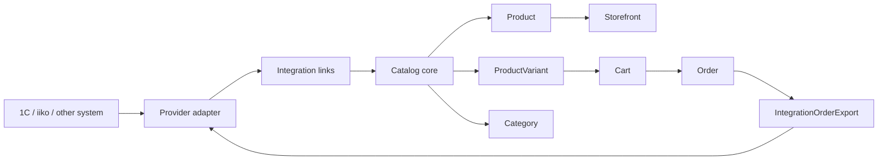

# Мозговой штурм: интеграции 1С и iiko

> [!summary]
> Документ фиксирует теоретическую модель будущих интеграций с 1С и iiko для нашей системы. Главная идея: backend остается стабильной витриной и владельцем пользовательского опыта, внешние системы подключаются через адаптеры. Для 1С нужен гибкий конструктор обращения к API, потому что у клиентов может быть разная конфигурация. Для iiko лучше делать типизированный адаптер, потому что у iiko есть стандартизированный iikoCloud API.

## 1. Контекст

Сейчас обсуждается не конкретная реализация под уже выданные доступы, а архитектурная заготовка. У нас пока нет реальной 1С клиента, поэтому нельзя зашивать формат API, набор полей и конкретные URL. При этом систему стоит проектировать так, чтобы позже подключение 1С не превратилось в отдельный ручной проект для каждого клиента.

По iiko ситуация другая: публичная документация есть, API стандартизирован. Там уже можно заранее выделить основные endpoints, сценарии авторизации, синхронизации меню и отправки заказов.

Целевая бизнес-логика:

- 1С или iiko могут быть источником каталога для отображения.
- Наша система хранит нормализованную копию данных для быстрой витрины, поиска, фильтров, корзины и заказов.
- Пользователь оформляет заказ у нас.
- Админ проверяет заказ в нашей админке.
- После завершения или подтверждения админом заказ отправляется во внешнюю систему.
- Ошибка внешней системы не должна ломать локальный заказ.

## 2. Текущая опора в backend

В проекте уже есть хороший фундамент интеграционного слоя.

Существующие модели:

- `Integration` - профиль интеграции каталога.
- `IntegrationProductLink` - связь внешнего товара с нашим `Product`.
- `IntegrationVariantLink` - связь внешней SKU/варианта с нашим `ProductVariant`.
- `IntegrationCategoryLink` - связь внешней категории с нашей `Category`.
- `IntegrationSyncRun` - запуск синхронизации.
- `IntegrationOrderExport` - экспорт локального заказа во внешнюю систему.
- `IntegrationWebhookEvent` - входящие события от внешних систем.

Существующий контракт адаптера:

- `testConnection()`
- `pullProducts()`
- `pullVariants()`
- `pullStock()`
- `pullPrices?()`
- `pushOrder?()`
- `reserveStock?()`
- `releaseReservation?()`

Текущий enum провайдера:

```prisma
enum IntegrationProvider {
  MOYSKLAD
}
```

Для будущей работы логично расширить его:

```prisma
enum IntegrationProvider {
  MOYSKLAD
  ONE_C
  IIKO
}
```

Это позволит развивать 1С и iiko как нормальные provider adapters внутри уже существующего integration-модуля.

## 3. Главный принцип

Наша система не должна становиться копией 1С, iiko или МойСклад. Внутри у нас стабильная модель:

- `Product` - карточка товара для витрины.
- `ProductVariant` - покупаемая SKU/вариант.
- `Category` - навигация витрины.
- `Cart` / `CartItem` - корзина.
- `Order` - локальный заказ.
- `Integration*Link` - мост между нашей моделью и внешней системой.
- `IntegrationOrderExport` - контроль отправки заказа наружу.

Внешняя система может иметь любые названия и структуры, но frontend и корзина должны работать от нашей модели.

Схема:



Главная формула:

> Внешняя система владеет учетными данными. Наша система владеет витриной, UX, корзиной, локальным заказом и надежным процессом обмена.

## 4. Два типа интеграций

### 4.1 1С: гибкий адаптер-конструктор

У 1С почти всегда разная реальность:

- у всех может быть свое API;
- разные конфигурации 1С;
- разные названия полей;
- разные форматы ответа;
- разные URL;
- разные схемы авторизации;
- где-то JSON, где-то XML, где-то CommerceML, где-то файл;
- где-то есть метод "получить изменения с даты", где-то только полная выгрузка;
- где-то заказ создается одним endpoint, где-то через несколько шагов.

Поэтому 1С нельзя проектировать как один жестко типизированный клиент. Нужен гибкий слой:

- профиль подключения;
- конструктор HTTP-запроса;
- mapping сущностей;
- mapping полей;
- трансформации;
- правила поиска дублей;
- логи сырого payload;
- dry-run.

### 4.2 iiko: типизированный адаптер

У iiko есть публичный iikoCloud API. Поэтому тут лучше не делать свободный конструктор всего API. Лучше сделать типизированный адаптер с настройками:

- `organizationId`;
- `terminalGroupId`;
- `externalMenuId`;
- `priceCategoryId`;
- `paymentTypeId`;
- `orderTypeId` или `orderServiceType`;
- `sourceKey`;
- режим заказа: доставка или заказ в зале.

Гибкость нужна в настройках, но не в структуре endpoints.

## 5. Общие сценарии для нашей системы

### 5.1 Импорт каталога для отображения

Поток:

```text
Внешняя система -> provider adapter -> нормализация -> Product/ProductVariant/Category -> витрина
```

Цель:

- быстро показывать каталог;
- не дергать внешнюю систему на каждый пользовательский запрос;
- сохранить работоспособность витрины при временной недоступности внешнего API;
- иметь поиск, фильтры, пагинацию и SEO от нашей базы;
- хранить связи с внешними ID для будущих обновлений и заказов.

### 5.2 Отправка заказа после действия админа

Поток:

```text
Пользователь оформил заказ
-> заказ появился у нас
-> админ проверил заказ
-> админ завершил/подтвердил заказ
-> создаем IntegrationOrderExport
-> отправляем заказ во внешнюю систему
-> сохраняем externalId/correlationId/response/error
```

Важно:

- не отправлять заказ слишком рано, если бизнес-процесс требует проверки админом;
- не отправлять один заказ дважды;
- иметь ручной retry;
- видеть payload запроса и ответа;
- ошибка экспорта не должна удалять и откатывать локальный заказ.

### 5.3 Одностороннее владение каталогом

Для 1С и iiko на первом этапе внешний источник является владельцем каталожных данных:

- название;
- артикул;
- категории;
- цена;
- остаток;
- доступность;
- изображения, если они приходят из источника;
- модификаторы, если они нужны в конкретном домене.

Наша система отображает и кэширует эти данные. Редактировать импортированные поля в нашей админке либо нельзя, либо можно только в виде локальных override-правил, которые явно отделены от импортированных данных.

## 6. Общая модель состояния

### 6.1 Статусы синхронизации

Уже есть:

```prisma
enum IntegrationSyncStatus {
  IDLE
  SYNCING
  SUCCESS
  ERROR
}

enum IntegrationSyncRunStatus {
  PENDING
  RUNNING
  SUCCESS
  ERROR
  SKIPPED
}
```

Этого достаточно для первого этапа.

В будущем может понадобиться больше детализации:

- `PARTIAL_SUCCESS` - часть записей обновилась, часть упала;
- `AUTH_ERROR` - проблема авторизации;
- `CONFIG_ERROR` - ошибка настройки mapping;
- `RATE_LIMITED` - внешний API ограничил частоту запросов.

Но сначала лучше не усложнять enum, а хранить детализацию в `error` и `metadata`.

### 6.2 Статусы экспорта заказа

Уже есть:

```prisma
enum IntegrationOrderExportStatus {
  PENDING
  RUNNING
  SUCCESS
  ERROR
  SKIPPED
}
```

Для iiko может понадобиться учитывать асинхронность команды:

```text
PENDING -> RUNNING -> WAITING_EXTERNAL_COMMAND -> SUCCESS
PENDING -> RUNNING -> WAITING_EXTERNAL_COMMAND -> ERROR
```

Можно не расширять enum сразу, а хранить внешний command state в `IntegrationOrderExport.response` или `rawMeta`.

## 7. Таблица связей как центр интеграций

Критически важны связи:

```text
external product id  -> Product.id
external variant id  -> ProductVariant.id
external category id -> Category.id
local order id       -> external order id
```

Без этого будут дубли:

- товар импортируется второй раз как новый;
- позиция заказа не может быть сопоставлена с внешней номенклатурой;
- удаленные/скрытые товары невозможно корректно пометить;
- повторная отправка заказа создаст дубль во внешней системе.

Правило:

> Внешний ID всегда важнее названия. Название не является надежным ключом.

Резервные ключи:

1. `externalId`
2. `externalCode`
3. `sku`
4. `barcode`
5. ручное сопоставление

По имени матчить можно только в dry-run или ручном режиме.

## 8. 1С: целевая идея

1С для нас:

```text
1С -> наш backend -> витрина
наш backend -> 1С: заказ после завершения админом
```

То есть:

- 1С владеет каталогом;
- наша система отображает каталог;
- заказ рождается у нас;
- админ подтверждает заказ у нас;
- заказ отправляется в 1С;
- external order id сохраняется у нас.

## 9. 1С: почему нужен конструктор

У клиентов может быть:

- типовая 1С;
- сильно доработанная 1С;
- внешний HTTP-сервис поверх 1С;
- CommerceML;
- выгрузка файла;
- API с русскими ключами;
- API с английскими ключами;
- одно поле `Цена`;
- массив `Цены`;
- остатки в товаре;
- остатки отдельным endpoint;
- категории как дерево;
- категории как строка;
- изображения как URL;
- изображения как base64;
- статусы удаления через `ПометкаУдаления`;
- активность через `isActive`;
- разные правила создания заказа.

Поэтому 1С-адаптер должен быть не "клиентом одного API", а настройкой обмена.

## 10. 1С: профиль интеграции

На уровне `Integration.metadata` можно хранить примерно такую структуру:

```json
{
  "kind": "one_c",
  "transport": "http",
  "baseUrl": "https://client.example.com/1c/api",
  "auth": {
    "type": "basic",
    "username": "user",
    "passwordRef": "encrypted-secret-id"
  },
  "format": "json",
  "catalogSource": "external",
  "orderExport": {
    "enabled": true,
    "trigger": "admin_completed"
  },
  "entities": {
    "products": {
      "enabled": true,
      "operation": "product_list"
    },
    "stock": {
      "enabled": true,
      "operation": "stock_list"
    },
    "orders": {
      "enabled": true,
      "operation": "order_create"
    }
  }
}
```

Варианты авторизации:

- `none`;
- `basic`;
- `bearer`;
- `api_key_header`;
- `api_key_query`;
- `custom_headers`;
- в будущем OAuth или подпись запроса.

## 11. 1С: конструктор HTTP-операций

Операция описывает, как сходить во внешний API.

Пример получения товаров:

```json
{
  "id": "product_list",
  "entity": "product",
  "direction": "import",
  "method": "GET",
  "path": "/products",
  "query": {
    "page": "{{page}}",
    "limit": 100,
    "updatedFrom": "{{lastSyncAt}}"
  },
  "response": {
    "itemsPath": "$.data.items",
    "nextPagePath": "$.data.nextPage",
    "totalPath": "$.data.total"
  }
}
```

Другой клиент может иметь такой вариант:

```json
{
  "id": "product_list",
  "entity": "product",
  "direction": "import",
  "method": "POST",
  "path": "/catalog/getItems",
  "body": {
    "fromDate": "{{lastSyncAt}}",
    "includeDeleted": true
  },
  "response": {
    "itemsPath": "$.result.goods"
  }
}
```

Пример создания заказа:

```json
{
  "id": "order_create",
  "entity": "order",
  "direction": "export",
  "method": "POST",
  "path": "/orders/create",
  "bodyTemplate": {
    "Номер": "{{order.externalNumber}}",
    "Дата": "{{order.createdAt}}",
    "Клиент": {
      "Имя": "{{customer.name}}",
      "Телефон": "{{customer.phone}}",
      "Email": "{{customer.email}}"
    },
    "Товары": "{{items}}",
    "Комментарий": "{{order.comment}}",
    "Сумма": "{{order.total}}"
  },
  "response": {
    "externalIdPath": "$.id",
    "externalCodePath": "$.number",
    "statusPath": "$.status"
  }
}
```

## 12. 1С: mapping товара

Наша нормализованная сущность:

```json
{
  "externalId": "1c-product-001",
  "externalCode": "000001",
  "name": "Молоко",
  "description": "Описание",
  "sku": "MILK-001",
  "barcode": "4600000000000",
  "categoryExternalId": "1c-category-001",
  "priceCents": 150050,
  "stock": 12,
  "archived": false,
  "imageUrls": ["https://example.com/image.jpg"]
}
```

Полевая настройка для 1С:

```json
{
  "entity": "product",
  "fields": {
    "externalId": "$.Ссылка",
    "externalCode": "$.Код",
    "name": "$.Наименование",
    "description": "$.Описание",
    "sku": "$.Артикул",
    "barcode": "$.Штрихкод",
    "categoryExternalId": "$.Группа.Ссылка",
    "categoryName": "$.Группа.Наименование",
    "priceCents": {
      "path": "$.Цена",
      "transforms": ["toNumber", "rublesToCents"]
    },
    "stock": {
      "path": "$.Остаток",
      "transforms": ["toNumber", "negativeToZero"]
    },
    "archived": {
      "path": "$.ПометкаУдаления",
      "transforms": ["toBoolean"]
    },
    "imageUrls": "$.Картинки[*].Url"
  }
}
```

Ключевая мысль:

> Mapping должен поддерживать не только "name = Наименование", но и путь, transform и fallback.

Пример fallback:

```json
{
  "name": {
    "path": "$.Наименование",
    "fallback": "$.Name",
    "transforms": ["trim"]
  }
}
```

## 13. 1С: трансформации

Минимальный набор:

- `trim`;
- `toString`;
- `toNumber`;
- `toBoolean`;
- `invertBoolean`;
- `rublesToCents`;
- `centsToRubles`;
- `negativeToZero`;
- `dateToIso`;
- `defaultValue`;
- `arrayFirst`;
- `join`;
- `split`;
- `lowercase`;
- `uppercase`;
- `mapEnum`;

Примеры:

```json
{
  "field": "archived",
  "source": "$.ПометкаУдаления",
  "transforms": ["toBoolean"]
}
```

```json
{
  "field": "isVisible",
  "source": "$.Активен",
  "transforms": ["toBoolean"]
}
```

```json
{
  "field": "priceCents",
  "source": "$.Цены[?(@.ТипЦены == 'Розничная')].Цена",
  "transforms": ["arrayFirst", "toNumber", "rublesToCents"]
}
```

## 14. 1С: импорт категорий

Категории могут приходить как отдельное дерево:

```json
{
  "Ссылка": "cat-001",
  "Наименование": "Молочные продукты",
  "Родитель": null
}
```

Или внутри товара:

```json
{
  "Группа": {
    "Ссылка": "cat-001",
    "Наименование": "Молочные продукты"
  }
}
```

Правила:

- если есть отдельный endpoint категорий - лучше импортировать дерево отдельно;
- если категорий нет отдельно - создавать категории по данным товара;
- связь хранить в `IntegrationCategoryLink`;
- `externalParentId` нужен для восстановления дерева;
- удаленные категории не удалять физически сразу, а скрывать или помечать.

## 15. 1С: варианты товара

1С может отдавать:

- один товар как одну SKU;
- характеристики номенклатуры как варианты;
- размеры/цвета внутри массива;
- отдельные товары вместо вариантов.

Наша система должна приводить это к:

```text
Product -> ProductVariant[]
```

Варианты нормализации:

1. Простая 1С без вариантов:
   - каждый внешний товар создает `Product`;
   - создается один default `ProductVariant`.

2. 1С с характеристиками:
   - номенклатура создает `Product`;
   - каждая характеристика создает `ProductVariant`;
   - атрибуты характеристики становятся `VariantAttribute`.

3. 1С отдает каждую SKU отдельным товаром:
   - можно группировать по `parentExternalId`, `modelCode`, `groupKey`;
   - если группировки нет, лучше не угадывать и создавать отдельные `Product`.

## 16. 1С: цены и остатки

Варианты:

- цена внутри товара;
- цена отдельным endpoint;
- несколько типов цен;
- остаток внутри товара;
- остаток отдельным endpoint;
- остаток по складам;
- остаток по характеристикам.

На первом этапе:

- брать одну витринную цену;
- брать один агрегированный остаток;
- записывать в `ProductVariant.price` и `ProductVariant.stock`;
- `Product.price` использовать как витринную агрегированную цену;
- если складов несколько, суммировать только разрешенные склады.

В metadata можно хранить:

```json
{
  "stock": {
    "mode": "aggregate",
    "warehouses": ["main", "shop-1"],
    "negativeToZero": true
  },
  "prices": {
    "type": "Розничная",
    "currency": "RUB"
  }
}
```

## 17. 1С: удаление и скрытие товаров

Нельзя сразу физически удалять товар, если он пропал из выгрузки.

Правила:

- если пришел флаг удаления - скрыть товар или вариант;
- если товар не пришел в полной выгрузке - увеличить `missingSyncCount`;
- после нескольких полных sync можно скрыть;
- физическое удаление не делать автоматически;
- использовать `missingSince`, `lastSeenAt`, `missingSyncCount`.

Это уже хорошо ложится на существующие поля `IntegrationProductLink` и `IntegrationVariantLink`.

## 18. 1С: export заказа

Триггер:

```text
админ завершил/подтвердил заказ -> экспорт в 1С
```

Не отправлять сразу при оформлении пользователем, если бизнес хочет ручную проверку.

Минимальный payload:

```json
{
  "order_id": "local-order-id",
  "order_number": "ORD-123",
  "created_at": "2026-05-19T12:00:00.000Z",
  "customer": {
    "name": "Иван",
    "phone": "+79990000000",
    "email": "ivan@example.com"
  },
  "items": [
    {
      "external_product_id": "1c-product-001",
      "external_variant_id": "1c-variant-001",
      "sku": "SKU-001",
      "name": "Товар",
      "quantity": 2,
      "price": 1500.5,
      "line_total": 3001
    }
  ],
  "total": 3001,
  "comment": "Позвонить перед доставкой"
}
```

Для 1С mapping заказа должен быть таким же гибким, как mapping товара:

```json
{
  "entity": "order",
  "direction": "export",
  "bodyTemplate": {
    "Номер": "{{order.number}}",
    "Дата": "{{order.createdAt}}",
    "Контрагент": {
      "Имя": "{{customer.name}}",
      "Телефон": "{{customer.phone}}"
    },
    "Товары": {
      "array": "order.items",
      "map": {
        "Номенклатура": "{{item.externalProductId}}",
        "Характеристика": "{{item.externalVariantId}}",
        "Артикул": "{{item.sku}}",
        "Количество": "{{item.quantity}}",
        "Цена": "{{item.unitPrice}}",
        "Сумма": "{{item.lineTotal}}"
      }
    },
    "Комментарий": "{{order.comment}}"
  }
}
```

## 19. 1С: защита от дублей заказов

Нужно использовать уже существующий `IntegrationOrderExport.idempotencyKey`.

Правила:

- на один `integrationId + orderId` только один успешный export;
- перед повторной отправкой проверять `externalId`;
- если `SUCCESS`, повторно не отправлять без явной команды;
- если `ERROR`, разрешить retry;
- payload предыдущей попытки хранить;
- response и ошибку хранить;
- если 1С поддерживает внешний номер заказа, передавать наш `orderId` или `order.number`.

## 20. 1С: dry-run

До реального подключения нужна возможность проверить mapping на mock JSON.

Dry-run должен показывать:

- сколько товаров будет создано;
- сколько обновлено;
- сколько скрыто;
- какие поля не найдены;
- какие значения не прошли transform;
- какие товары не имеют externalId;
- какие товары совпадают по sku/barcode;
- пример нормализованной записи.

Пример входа:

```json
{
  "Ссылка": "1c-product-001",
  "Наименование": "Товар тестовый",
  "Артикул": "SKU-001",
  "Цена": "1500.50",
  "Остаток": "12",
  "ПометкаУдаления": false
}
```

Пример результата:

```json
{
  "externalId": "1c-product-001",
  "name": "Товар тестовый",
  "sku": "SKU-001",
  "priceCents": 150050,
  "stock": 12,
  "archived": false
}
```

## 21. 1С: MVP

Минимальная версия:

1. Добавить provider `ONE_C`.
2. Сделать metadata для HTTP JSON-подключения.
3. Сделать `testConnection`.
4. Сделать импорт категорий и товаров по mock/настраиваемому endpoint.
5. Сделать field mapping через JSONPath.
6. Сделать базовые transforms.
7. Сохранять `IntegrationProductLink`, `IntegrationVariantLink`, `IntegrationCategoryLink`.
8. Делать dry-run.
9. Делать экспорт заказа после действия админа.
10. Сохранять `IntegrationOrderExport`.

Отложить:

- двусторонний обмен товарами;
- создание товара у нас и отправку в 1С;
- сложное разрешение конфликтов;
- резервирование остатков;
- CommerceML;
- XML;
- UI-конструктор всех операций.

## 22. iiko: актуальная основа

Для iiko целевой API:

- iikoCloud API docs: `https://api-ru.iiko.services/docs`
- OpenAPI JSON: `https://api-ru.iiko.services/api-docs/docs`
- официальный портал iikoAPI: `https://api.iiko.ru/`
- iikoFront API docs: `https://iiko.github.io/front.api.doc/`

Актуальность заметки по iiko: 2026-05-19.

iikoCloud API нужен для:

- получения организаций;
- получения терминальных групп;
- получения меню;
- получения стоп-листов;
- получения справочников оплат;
- создания доставки;
- создания заказа в зале;
- проверки статуса асинхронной команды.

iikoFront API нужен для локальных плагинов внутри кассового ПО. Для нашего backend-адаптера это не первый выбор.

## 23. iiko: авторизация

Есть старый и простой вариант:

```http
POST /api/1/access_token
```

Тело:

```json
{
  "apiLogin": "..."
}
```

Ответ:

```json
{
  "correlationId": "...",
  "token": "..."
}
```

Токен живет стандартно 1 час. Дальше запросы:

```http
Authorization: Bearer <token>
```

Есть новый вариант:

```http
POST /api/v2/access_token
```

Тело:

```json
{
  "apiKey": "...",
  "appId": "...",
  "clientSecret": "..."
}
```

В metadata адаптера стоит поддержать оба режима:

```json
{
  "auth": {
    "mode": "api_login",
    "apiLoginRef": "encrypted-secret-id"
  }
}
```

```json
{
  "auth": {
    "mode": "app_credentials",
    "apiKeyRef": "encrypted-secret-id",
    "appId": "00000000-0000-0000-0000-000000000000",
    "clientSecretRef": "encrypted-secret-id"
  }
}
```

## 24. iiko: первичная настройка

Endpoints:

```text
POST /api/1/organizations
POST /api/1/terminal_groups
POST /api/1/payment_types
POST /api/1/deliveries/order_types
```

Что выбрать и сохранить:

- `organizationId` - организация ресторана;
- `terminalGroupId` - группа терминалов, куда отправлять заказы;
- `paymentTypeId` - тип оплаты;
- `orderTypeId` или `orderServiceType` - тип заказа;
- `sourceKey` - источник заказа;
- `externalMenuId` - внешнее меню;
- `priceCategoryId` - категория цен, если используется.

Пример metadata:

```json
{
  "kind": "iiko",
  "baseUrl": "https://api-ru.iiko.services",
  "auth": {
    "mode": "api_login",
    "apiLoginRef": "encrypted-secret-id"
  },
  "organizationId": "550e8400-e29b-41d4-a716-446655440000",
  "terminalGroupId": "660e8400-e29b-41d4-a716-446655440001",
  "externalMenuId": "12345",
  "priceCategoryId": null,
  "paymentTypeId": "770e8400-e29b-41d4-a716-446655440002",
  "orderMode": "delivery",
  "orderServiceType": "DeliveryByCourier",
  "sourceKey": "catalog",
  "checkStopList": true
}
```

## 25. iiko: меню и каталог

Основные endpoints:

```text
POST /api/1/nomenclature
POST /api/2/menu
POST /api/2/menu/by_id
POST /api/1/stop_lists
```

`/api/1/nomenclature`:

- базовая номенклатура;
- группы;
- продукты;
- размеры;
- цены;
- revision;
- modifiers;
- imageLinks.

`/api/2/menu`:

- список external menus;
- price categories.

`/api/2/menu/by_id`:

- конкретное внешнее меню;
- категории;
- товары;
- размеры;
- цены по организациям;
- картинки;
- скрытие позиций;
- модификаторы;
- расписания.

Для витрины лучше стартовать с `/api/2/menu` + `/api/2/menu/by_id`, потому что это ближе к публичному меню ресторана. `/api/1/nomenclature` оставить как fallback или источник технических данных.

## 26. iiko: mapping меню в нашу модель

iiko external menu:

```text
ExternalMenuCategory -> Product.category
ExternalMenuItem     -> Product
ExternalMenuItemSize -> ProductVariant
```

Пример:

```text
category.id       -> IntegrationCategoryLink.externalId
category.name     -> Category.name
item.itemId       -> IntegrationProductLink.externalId
item.sku          -> Product.sku
item.name         -> Product.name
item.description  -> Product.description
size.sizeId       -> IntegrationVariantLink.externalId
size.sku          -> ProductVariant.sku
size.price        -> ProductVariant.price
size.buttonImageUrl / category images -> ProductMedia
item.isHidden     -> visibility
```

Если у блюда один размер:

- создать `Product`;
- создать default `ProductVariant`;
- external variant id можно построить из `itemId + sizeId`, если `sizeId` пустой.

Если размеров несколько:

- один `Product`;
- несколько `ProductVariant`;
- размер становится атрибутом варианта.

## 27. iiko: цены

В iiko цены могут зависеть от:

- организации;
- price category;
- размера блюда;
- внешнего меню.

На первом этапе:

- импортировать цены из выбранного `externalMenuId`;
- если есть `priceCategoryId`, использовать его;
- для нескольких организаций брать цену текущей `organizationId`;
- хранить цену в `ProductVariant.price`;
- `Product.price` считать как минимальную или default цену.

Открытый вопрос:

> Если один catalog обслуживает несколько ресторанов/организаций iiko, нужна ли одна витрина с выбором точки или отдельный catalog на каждую организацию?

## 28. iiko: стоп-листы и доступность

Endpoint:

```text
POST /api/1/stop_lists
```

Использование:

- регулярно обновлять недоступные позиции;
- при создании заказа можно включать `checkStopList`;
- на витрине скрывать или помечать позиции из стоп-листа;
- хранить last sync по stop-list отдельно или как `STOCK` sync run.

Для нашей модели:

```text
stop-list item -> ProductVariant.stock = 0 или isAvailable = false
```

Если у нас пока нет отдельного `isAvailable`, можно:

- ставить `stock = 0`;
- хранить причину в `IntegrationVariantLink.rawMeta`;
- не затирать реальный stock, если он нужен отдельно.

## 29. iiko: создание заказа

Для доставки:

```text
POST /api/1/deliveries/create
```

Для заказа в зале:

```text
POST /api/1/order/create
```

Оба сценария являются командами. После создания нужно проверять:

```text
POST /api/1/commands/status
```

Это важное отличие от 1С:

> HTTP 200 на create еще не означает, что касса окончательно приняла заказ.

## 30. iiko: payload заказа доставки

Минимально нужно:

```json
{
  "organizationId": "550e8400-e29b-41d4-a716-446655440000",
  "terminalGroupId": "660e8400-e29b-41d4-a716-446655440001",
  "order": {
    "externalNumber": "ORD-123",
    "phone": "+79990000000",
    "orderServiceType": "DeliveryByCourier",
    "comment": "Позвонить перед доставкой",
    "customer": {
      "type": "one-time",
      "name": "Иван"
    },
    "items": [
      {
        "type": "Product",
        "productId": "iiko-product-id",
        "amount": 2,
        "price": 1500.5
      }
    ],
    "sourceKey": "catalog"
  },
  "createOrderSettings": {
    "checkStopList": true,
    "transportToFrontTimeout": 8
  }
}
```

Реальный payload нужно уточнять на тестовом аккаунте iiko, потому что у разных ресторанов могут быть настройки доставки, типов оплат, терминальных групп и адресации.

## 31. iiko: связь заказа с нашими товарами

При экспорте заказа каждая позиция должна иметь внешний ID iiko:

```text
OrderItem.variantId
-> IntegrationVariantLink.variantId
-> IntegrationVariantLink.externalId
-> iiko productId / sizeId
```

Если связь не найдена:

- экспорт заказа должен упасть в `ERROR`;
- в `lastError` написать, какая позиция не имеет iiko mapping;
- заказ не должен отправляться частично;
- админ должен увидеть понятную ошибку.

## 32. iiko: асинхронный export

Поток:

```text
1. Создать IntegrationOrderExport PENDING
2. Взять job в очередь
3. Получить/обновить token
4. POST /api/1/deliveries/create или /api/1/order/create
5. Сохранить correlationId
6. Перевести export в ожидание внешней команды
7. Poll POST /api/1/commands/status
8. При успехе сохранить externalId/status/response
9. При ошибке сохранить lastError/response
```

Варианты хранения:

```json
{
  "iiko": {
    "correlationId": "00000000-0000-0000-0000-000000000000",
    "commandState": "InProgress",
    "lastCommandStatusAt": "2026-05-19T12:00:00.000Z"
  }
}
```

Это можно хранить в `IntegrationOrderExport.response` или добавить `rawMeta`, если потребуется.

## 33. iiko: модификаторы и комбо

Для ресторана это важная тема, но для MVP лучше отложить.

В iiko есть:

- modifiers;
- group modifiers;
- combos;
- sizes;
- external menu categories;
- schedule;
- hidden flags.

Минимальный MVP может поддержать только простые блюда и размеры.

Следующий уровень:

- модификаторы как дополнительные позиции или вложенные настройки `CartItem`;
- обязательные модификаторы;
- платные модификаторы;
- комбо;
- расчет цены комбо;
- ограничения выбора.

Открытый архитектурный вопрос:

> Есть ли в нашей текущей модели корзины место для модификаторов блюд, или нужно отдельно проектировать `CartItemModifier` / `OrderItemModifier`?

## 34. iiko: MVP

Минимальная версия:

1. Добавить provider `IIKO`.
2. Реализовать iiko auth v1 через `/api/1/access_token`.
3. Реализовать token cache до 1 часа с безопасным обновлением.
4. Реализовать `testConnection` через `/api/1/organizations`.
5. Дать выбрать `organizationId`.
6. Дать выбрать `terminalGroupId`.
7. Дать выбрать external menu через `/api/2/menu`.
8. Импортировать меню через `/api/2/menu/by_id`.
9. Сопоставить категории, товары, размеры.
10. Импортировать картинки, если URL доступны.
11. Импортировать стоп-листы через `/api/1/stop_lists`.
12. Экспортировать заказ после действия админа через `/api/1/deliveries/create`.
13. Проверять статус через `/api/1/commands/status`.
14. Логировать request/response/correlationId в `IntegrationOrderExport`.

Отложить:

- auth v2;
- заказы в зале через `/api/1/order/create`;
- платежи;
- лояльность;
- delivery restrictions;
- адресные справочники;
- модификаторы;
- комбо;
- webhooks;
- ручную синхронизацию отдельных блюд.

## 35. Сравнение 1С и iiko

| Область | 1С | iiko |
| --- | --- | --- |
| API | Может быть любым | Стандартизированный iikoCloud API |
| Подход | Гибкий конструктор | Типизированный адаптер |
| Каталог | Товары/номенклатура в произвольном формате | External menu / nomenclature |
| Цены | Произвольные поля, типы цен | External menu, price categories |
| Остатки | В товаре или отдельный endpoint | Stop-lists, возможно отдельные данные |
| Заказ | Произвольный endpoint/payload | `/deliveries/create` или `/order/create` |
| Статус создания | Зависит от клиента | Асинхронная команда + `/commands/status` |
| Mapping | Обязателен и гибкий | В основном фиксированный |
| Риск | Непредсказуемость реализации клиента | Сложность ресторанной предметки |

## 36. Admin UX

Для 1С:

- экран профиля подключения;
- тест соединения;
- список операций;
- редактор endpoint;
- редактор field mapping;
- редактор transform rules;
- окно проверки mapping на sample payload;
- dry-run синхронизации;
- лог sync run;
- лог сырых request/response;
- ручная кнопка "Повторить экспорт заказа".

Для iiko:

- ввести credentials;
- проверить подключение;
- выбрать организацию;
- выбрать terminal group;
- выбрать меню;
- выбрать price category;
- выбрать тип заказа;
- выбрать тип оплаты;
- включить/выключить check stop-list;
- запустить импорт меню;
- посмотреть статус последнего импорта;
- посмотреть ошибки экспорта заказов.

## 37. Очереди и надежность

Импорт и экспорт должны выполняться в фоне.

Причины:

- внешние API могут быть медленными;
- iiko create order асинхронный;
- 1С может зависнуть или вернуть нестандартную ошибку;
- retry не должен блокировать HTTP-запрос админки;
- нужна история попыток.

Рекомендуемый подход:

- BullMQ job на sync;
- BullMQ job на order export;
- idempotency key для заказа;
- exponential backoff;
- ограничение количества попыток;
- отдельная кнопка ручного retry;
- redaction секретов в логах;
- сохранение correlationId/requestId.

## 38. Безопасность

Нельзя хранить секреты открытым текстом в `metadata`.

Нужно:

- хранить ссылки на зашифрованные секреты;
- редактировать секреты отдельно;
- не писать токены в логи;
- редактировать `Authorization`, `apiLogin`, `apiKey`, `clientSecret`;
- ограничить доступ к настройкам интеграций правами админа;
- в `raw payload` не хранить лишние персональные данные без необходимости.

## 39. Наблюдаемость

Для каждой интеграции полезны метрики:

- последний успешный sync;
- длительность sync;
- количество созданных товаров;
- количество обновленных товаров;
- количество скрытых товаров;
- количество ошибок mapping;
- количество экспортированных заказов;
- количество failed exports;
- среднее время ответа внешнего API;
- количество retry;
- последний external error.

В логах важно иметь:

- `catalogId`;
- `integrationId`;
- `provider`;
- `syncRunId`;
- `orderExportId`;
- `externalId`;
- `correlationId`;
- `operation`.

## 40. Что тестировать без реальных доступов

Для 1С:

- JSONPath mapping на mock payload;
- transforms;
- отсутствие обязательных полей;
- дубли externalId;
- товар без категории;
- товар без цены;
- товар с отрицательным остатком;
- пометка удаления;
- dry-run;
- order payload template;
- idempotency export.

Для iiko:

- парсинг OpenAPI типов можно сделать позже, но адаптер тестировать на fixtures;
- token cache;
- mapping external menu category/item/size;
- товар с одним размером;
- товар с несколькими размерами;
- hidden item;
- price by organization;
- stop-list item;
- create order payload;
- commands/status polling;
- ошибка позиции без external mapping.

## 41. Предлагаемые capability flags

Для `ONE_C`:

```ts
{
  productImport: true,
  variantImport: true,
  stockImport: true,
  imageImport: true,
  orderExport: true,
  reservation: false,
  webhook: false
}
```

Для `IIKO` MVP:

```ts
{
  productImport: true,
  variantImport: true,
  stockImport: true,
  imageImport: true,
  orderExport: true,
  reservation: false,
  webhook: false
}
```

В будущем для iiko можно включить `webhook`, если будет понятный сценарий входящих событий.

## 42. Возможные доработки моделей

Сразу менять БД не обязательно, но в будущем могут понадобиться:

1. `IntegrationRawPayloadLog`
   - хранить sample request/response отдельно от sync run;
   - включать TTL или ограничение размера.

2. `IntegrationMapping`
   - для 1С хранить endpoint/mapping/transforms как отдельные сущности, а не только в `metadata`;
   - полезно для UI-конструктора.

3. `IntegrationSecret`
   - если текущего механизма шифрования metadata недостаточно.

4. `IntegrationOrderExport.rawMeta`
   - для iiko command status, correlationId, external command state.

5. `ProductVariant.isAvailable`
   - чтобы не смешивать "нет в наличии" и "в стоп-листе".

6. `CartItemModifier` / `OrderItemModifier`
   - для iiko modifiers и combo.

## 43. Важные решения на сейчас

Рекомендуемые решения:

1. 1С проектировать как гибкий `ONE_C` provider с API-конструктором.
2. iiko проектировать как типизированный `IIKO` provider.
3. Каталог из 1С/iiko считать внешним источником истины.
4. Наша база остается read model/cache для витрины.
5. Заказ отправлять наружу только после действия админа.
6. Использовать существующий `IntegrationOrderExport`.
7. Не делать двусторонний товарный обмен в первой версии.
8. Не делать резервирование остатков в первой версии.
9. Сначала покрыть mock fixtures и dry-run.
10. UI-конструктор для 1С делать после backend-ядра mapping.

## 44. Открытые вопросы

1. Какой статус заказа у нас считается триггером экспорта: `completed`, `confirmed`, отдельная кнопка или оба варианта?
2. Нужно ли отправлять заказ автоматически при смене статуса или только по кнопке "Отправить"?
3. Нужно ли позволять редактировать импортированные товары локально?
4. Если локальное поле изменено руками, должен ли следующий импорт его перетереть?
5. Нужны ли локальные override-поля для SEO, описаний и изображений?
6. Как показывать товар, если внешняя система временно недоступна?
7. Как долго хранить raw payload с персональными данными заказа?
8. Для iiko нужен только delivery-сценарий или еще hall/table order?
9. Нужны ли модификаторы iiko в MVP?
10. Один catalog соответствует одной организации iiko или нескольким?
11. Нужно ли поддерживать несколько типов цен в одной витрине?
12. Нужно ли импортировать изображения из 1С/iiko в наш S3 или использовать внешние URL?

## 45. Roadmap

### Phase 0: проектирование

- Зафиксировать provider contracts для 1С и iiko.
- Уточнить status trigger для экспорта заказа.
- Решить, где хранить mapping: metadata или отдельные таблицы.
- Подготовить fixtures для 1С и iiko.

### Phase 1: 1С mock core

- Добавить `ONE_C` provider.
- Реализовать JSONPath mapper.
- Реализовать transform pipeline.
- Сделать dry-run на sample payload.
- Сделать нормализацию товара, категории, варианта.

### Phase 2: 1С order export

- Реализовать order body template.
- Создавать `IntegrationOrderExport`.
- Отправлять заказ после действия админа.
- Добавить retry и логирование.

### Phase 3: iiko catalog import

- Добавить `IIKO` provider.
- Реализовать auth v1.
- Реализовать organizations/terminal groups/menu selection.
- Импортировать `/api/2/menu/by_id`.
- Импортировать stop-lists.

### Phase 4: iiko order export

- Реализовать `/api/1/deliveries/create`.
- Реализовать `/api/1/commands/status`.
- Сохранять correlationId и response.
- Добавить retry.

### Phase 5: Admin UX

- Экран настройки 1С.
- Экран настройки iiko.
- Dry-run preview.
- Sync logs.
- Order export logs.
- Retry failed export.

## 46. Источники по iiko

- Официальная страница iikoAPI: https://api.iiko.ru/
- iikoCloud API docs: https://api-ru.iiko.services/docs
- iikoCloud OpenAPI JSON: https://api-ru.iiko.services/api-docs/docs
- iikoFront API docs: https://iiko.github.io/front.api.doc/

